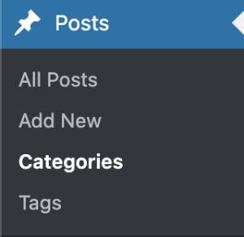
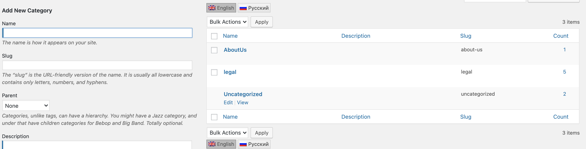
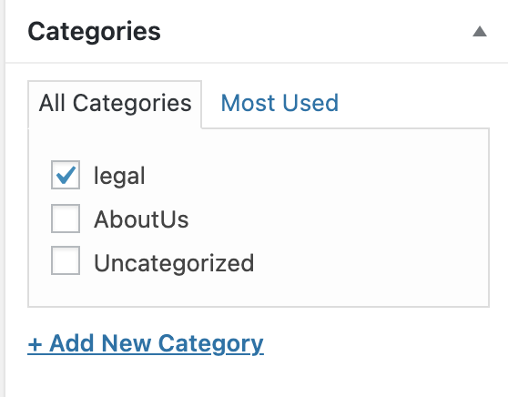

<ul class="nav nav-tabs" role="tablist">
    <li class="active">
        <a href="#english" role="tab" id="english-tab" data-toggle="tab" data-link="english">English</a>
    </li>
    <li>
        <a href="#russian" role="tab" id="russian-tab" data-toggle="tab" data-link="russian">Russian</a>
    </li>
</ul>
<div class="tab-content">
<div class="tab-pane fade active in" id="c-english">

# 3.2.5.5. Post menu ( Меню с легал текстами )

To add items to the menu with legal information, you need to create posts in the project's WordPress engine.

## **Getting started:**  
Create a new category of posts:    

   

By default, two categories are available and added to the post menu: **legal** and **about-us**.  
      
If these categories have not yet been created in the project's WordPress engine, then you need to do this in the section above.  

## **Creating menu items:**  
In the general list of posts, create a new post with the same slug as that of the legal information page.

The default slugs for the engine are as follows:
```typescript
export const staticConfig: IStaticConfig = {
    pages: [
        'terms-and-conditions',
        'privacy-policy',
        'responsible-game',
        'fair-play',
        'game-rules',
    ],
    wpPlugins:{
}
```
In this post, indicate the category for which you want to add the menu item:

 

Then, the corresponding item will appear as a menu post:

  

## **About Us**

By default, a created post in this category links to the contact page. The slug can be used for accessing the contact page and is passed as a parameter for **ui - router**.

## **Links to external webpages:**

The menu post supports links to other pages: to enable this feature, activate the ACF plug-in in Wordpress, specify the `outer_link` field and then indicate the address relative to your website's URL.   

If this is a link to an external resource, then specify the URL of the source in the component's parameters in the following format: `basePath.url/{{slug}}`.

```typescript
this.$params.common.basePath?.url;
``` 

## **Sorting menu items:**

To sort the menu items, make sure to activate the **ACF** plug-in and indicate the `sort_weight` field for the corresponding post.


</div>
<div class="tab-pane fade" id="c-russian">

# 3.2.5.5. Post menu ( Меню с легал текстами )

Для того, чтобы добавить пункты в меню с легал информацией нужно создать посты в вордпрессе проекта.

## **Начало работы:**  
Нужно создать новую категорию постов:  

 

По умолчанию доступно две категории, которые попадают в пост меню - **legal** и **about-us**.  
  
Если данные категории в вордпрессе проекта еще не созданы. то нужно это сделать в разделе, указанном выше.  

## **Создание пунктов меню:**  
Нужно в общем списке постов создать новый пост, слаг которого будет эквивалентен слагу легал страницы.

Слаги по умолчанию для движка:
```typescript
export const staticConfig: IStaticConfig = {
    pages: [
        'terms-and-conditions',
        'privacy-policy',
        'responsible-game',
        'fair-play',
        'game-rules',
    ],
    wpPlugins:{
}
```
В посте нужно указать категорию, пункт меню для которой нужно добавить:

 

После этого пункт отобразиться в пост меню: 

  

## **About Us**

По умолчанию созданный пост в данной категории ведет на страницу контактов. По слагу можно попасть на определенную страницу контактов, слаг передается как параметр для **ui - router**. 

## **Ссылки на внешние страницы:**

Пост меню поддерживает ссылки на другие страницы, для этого нужно активировать плагин  **ACF** в вордпрессе указать поле  `outer_link` и задать адрес относительно адреса сайта.

Если ссылка на внешний ресурс, то нужно в параметрах компонента указать url  на источник и тогда будет вид ссылки `basePath.url/{{slug}}`. 

```typescript
this.$params.common.basePath?.url;
``` 

## **Сортировка пунктов меню:**

Для сортировки пунктов нужно также активировать плагин **ACF** и указать поле `sort_weight` для конкретного поста. 

</div>
</div>
