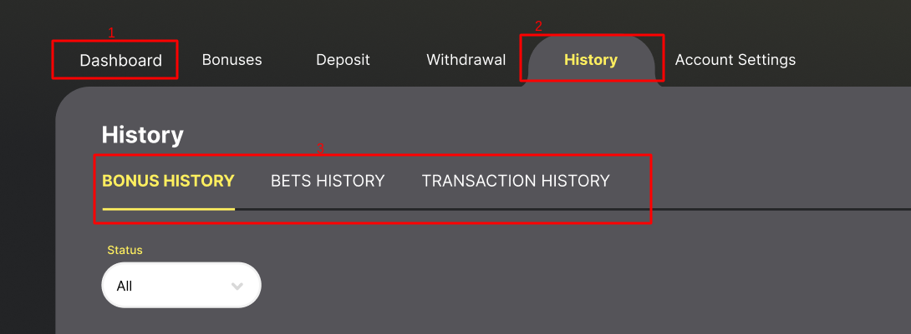

<ul class="nav nav-tabs" role="tablist">
    <li class="active">
        <a href="#english" role="tab" id="english-tab" data-toggle="tab" data-link="english">English</a>
    </li>
    <li>
        <a href="#russian" role="tab" id="russian-tab" data-toggle="tab" data-link="russian">Russian</a>
    </li>
</ul>
<div class="tab-content">
<div class="tab-pane fade active in" id="c-english">

# 3.2.5.6. Profile menu

## List of available menu items
The menu settings are stored in the [src/modules/menu/system/config/profile-menu.config.ts]() file   
The `wlcProfileMenuItemsGlobal` constant contains button aliases. Each alias uses own settings for menu buttons.
```typescript
export const wlcProfileMenuItemsGlobal: MenuParams.IMenuItemsGlobal = {
    'profile-menu:my-account': {
        name: gettext('My account'),
        class: 'my-account',
        type: 'title',
        params: {
            state: {
                parent: 'app.profile.main',
                name: 'app.profile.main.info',
                params: {},
            },
        },
    },
    'profile-menu:account-settings': {
        name: gettext('Account settings'),
        class: 'account-settings             ',
        type: 'title',
        params: {
            state: {
                parent: 'app.profile.main',
                name: 'app.profile.main.info',
                params: {},
            },
        },
    },
    'profile-menu:edit-profile': {
        name: gettext('Edit profile'),
        type: 'sref',
        icon: 'icons/edit-profile',
        class: 'edit-profile',
        params: {
            state: {
                name: 'app.profile.main.info',
                params: {},
            },
        },
    },
```

## The default menu configuration
You can use the button aliases to build the configuration of the menu. The [src/modules/menu/system/config/menu.config.ts]() file stores the default configuration of the menu
```typescript
import {IMenuConfig} from '../interfaces/menu.interface';
export const menuConfig: IMenuConfig = {
    profileMenu: {
        items: [
            'profile-menu:dashboard',
            'profile-menu:bonuses-as-offers',
            'profile-menu:store',
            'profile-menu:cash-deposit',
            'profile-menu:cash-withdrawal',
            {
                parent: 'profile-menu:history',
                items: [
                    'profile-menu:bonuses-history',
                    'profile-menu:bets-history',
                    'profile-menu:transaction-history',
                    'profile-menu:tournaments-history',
                ],
            },
            {
                parent: 'profile-menu:account-settings',
                items: [
                    'profile-menu:edit-profile',
                    'profile-menu:verification',
                    'profile-menu:messages',
                ],
            },
        ],
        icons: {
            folder: 'wlc/icons/european/v1',
            use: true,
        },
    },
};
```
If the element is passed **as a string**, as in `'profile-menu:dashboard'`, then it will be a standard menu button (like element 1 in the screenshot) that opens the profile page and doesn't have own submenu.

If the element is passed **as an object**, then the system can use either the `parent` key to create a menu button (like element 2 in the screenshot), or the `items` key to create a button in the profile's submenu (like element 3 in the screenshot). 



## Setting up a button with a submenu
This button must have the type: `'title'` key and the `params.state.parent` key in which the shared parent state for all submenu buttons is indicated (in this case, it's `'app.profile.main'`).  
Indicating the parent state allows the button to be highlighted upon activation of the states associated with child buttons.
```typescript
'profile-menu:account-settings': {
        name: gettext('Account settings'),
        class: 'account-settings             ',
        type: 'title',
        params: {
            state: {
                parent: 'app.profile.main',
                name: 'app.profile.main.info',
                params: {},
            },
        },
    },
```

Then, this button will be inserted into the menu configuration as an object
```typescript
const wlcProfileMenuItems: MenuParams.MenuConfigItem[] = [
    {
        parent: 'profile-menu:account-settings',
        items: [
            'profile-menu:edit-profile',
            'profile-menu:verification',
            'profile-menu:messages',
        ],
    },
};
```

## Reassigning the profile menu in your project
The format is the same as for the default menu. The menu can be reassigned in your project using the $menu.profileMenu key in the [config/frontend/05.menu.config.ts]() file
```typescript
import {IMenuConfig} from 'wlc-engine/modules/menu';  
 
export const $menu: IMenuConfig = {
    profileMenu: {
        items: [
            'profile-menu:dashboard',
            'profile-menu:bonuses-as-offers',
            'profile-menu:cash-deposit',
            'profile-menu:cash-withdrawal',
            {
                parent: 'profile-menu:account-settings',
                items: [
                    'profile-menu:edit-profile',
                    'profile-menu:verification',
                    'profile-menu:messages',
                ],
            },
            {
                parent: 'profile-menu:tournaments',
                items: [
                    'profile-menu:tournaments-current',
                    'profile-menu:tournaments-active',
                    'profile-menu:tournaments-history',
                ],
            },
        ],
    },
};
```

## Filtering the menu items
  The [src/modules/menu/system/config/profile-menu.config.ts]() file contains the `profileMenuFilter` constant that stores a mapping between the configuration key and the menu item alias.
```typescript
export const profileMenuFilter: ProfileMenuParams.IProfileMenuFilter[] = [
    {
        config: '$base.profile.messages.use',
        item: 'profile-menu:messages',
    },
    {
        config: '$base.profile.verification.use',
        item: 'profile-menu:verification',
    },
    {
        config: '$base.tournaments.use',
        item: 'profile-menu:tournaments',
    },
    {
        config: '$base.profile.bonuses.system.use',
        item: 'profile-menu:bonuses-system',
    },
    {
        config: '$base.profile.bonuses.inventory.use',
        item: 'profile-menu:bonuses-inventory',
    },
    {
        config: '$base.profile.store.use',
        item: 'profile-menu:store',
    },
    {
        config: '$base.profile.referrals.use',
        item: 'profile-menu:referrals',
    },
    {
        config: '$base.profile.dashboard.use',
        item: 'profile-menu:dashboard',
    },
    {
        config: '$base.profile.wallet.use',
        item: 'profile-menu:cash-wallet',
    },
];
```
If you set a specific configuration key to "true", then the corresponding menu button will disappear from the menu (whether this button can be found in the submenu by the `items` key or not).   
Note that if the button's alias is used in the menu configuration in an object by the `parent` key, then the entire submenu will be deleted.
  
For example, indicating the `$base.tournaments.use = true` key will remove the block of tournaments from the configuration below.
```typescript
import {IMenuConfig} from 'wlc-engine/modules/menu';
export const $menu: IMenuConfig = {
    profileMenu:
        items: [
            'profile-menu:dashboard',
            'profile-menu:bonuses-as-offers',
            'profile-menu:cash-deposit',
            'profile-menu:cash-withdrawal',
            {
                parent: 'profile-menu:account-settings',
                items: [
                    'profile-menu:edit-profile',
                    'profile-menu:verification',
                    'profile-menu:messages',
                ],
            },
            { // Will be deleted
                parent: 'profile-menu:tournaments',
                items: [
                    'profile-menu:tournaments-current',
                    'profile-menu:tournaments-active',
                    'profile-menu:tournaments-history',
                ],
            },
        ],
    },
}; 
```

</div>
<div class="tab-pane fade" id="c-russian">

# 3.2.5.6. Меню профиля

## Список доступных элементов меню
  Настройки меню хранятся в файле [src/modules/menu/system/config/profile-menu.config.ts]()  
  В константе `wlcProfileMenuItemsGlobal` содержатся алиасы кнопок. У каждого алиаса свои настройки для кнопки меню.
```typescript
export const wlcProfileMenuItemsGlobal: MenuParams.IMenuItemsGlobal = {
    'profile-menu:my-account': {
        name: gettext('My account'),
        class: 'my-account',
        type: 'title',
        params: {
            state: {
                parent: 'app.profile.main',
                name: 'app.profile.main.info',
                params: {},
            },
        },
    },
    'profile-menu:account-settings': {
        name: gettext('Account settings'),
        class: 'account-settings             ',
        type: 'title',
        params: {
            state: {
                parent: 'app.profile.main',
                name: 'app.profile.main.info',
                params: {},
            },
        },
    },
    'profile-menu:edit-profile': {
        name: gettext('Edit profile'),
        type: 'sref',
        icon: 'icons/edit-profile',
        class: 'edit-profile',
        params: {
            state: {
                name: 'app.profile.main.info',
                params: {},
            },
        },
    },
```

## Дефолтная конфигурация меню
  Используя алиасы кнопок, можно выстраивать конфигурацию меню. В файле [src/modules/menu/system/config/menu.config.ts]() хранится дефолтная конфигурация меню
```typescript
import {IMenuConfig} from '../interfaces/menu.interface';
export const menuConfig: IMenuConfig = {
    profileMenu: {
        items: [
            'profile-menu:dashboard',
            'profile-menu:bonuses-as-offers',
            'profile-menu:store',
            'profile-menu:cash-deposit',
            'profile-menu:cash-withdrawal',
            {
                parent: 'profile-menu:history',
                items: [
                    'profile-menu:bonuses-history',
                    'profile-menu:bets-history',
                    'profile-menu:transaction-history',
                    'profile-menu:tournaments-history',
                ],
            },
            {
                parent: 'profile-menu:account-settings',
                items: [
                    'profile-menu:edit-profile',
                    'profile-menu:verification',
                    'profile-menu:messages',
                ],
            },
        ],
        icons: {
            folder: 'wlc/icons/european/v1',
            use: true,
        },
    },
};
```
Если элемент передается **в виде строки**, как к примеру `'profile-menu:dashboard'`, то это будет обычная кнопка меню (см 1 элемент в скрине), открывающая страницу профиля, подменю у нее нету.

Если **в виде объекта**, то по ключу `parent` будет сформирована кнопка меню, являющаяся разделом (см 2 элемент в скрине), а по ключу `items` кнопки попадут в подменю профиля (см 3 элемент в скрине).  


## Настройка кнопки, у которой будет подменю
  У данной кнопки должен быть ключ type: `'title'` и ключ `params.state.parent`, в котором указывается общий родительский стейт для всех кнопок подменю (в данном случае это `'app.profile.main'`).  
  Указание родительского стейта позволяет подсвечивать кнопку, когда мы находимся на стейтах, связанных с дочерними кнопками.
```typescript
'profile-menu:account-settings': {
        name: gettext('Account settings'),
        class: 'account-settings             ',
        type: 'title',
        params: {
            state: {
                parent: 'app.profile.main',
                name: 'app.profile.main.info',
                params: {},
            },
        },
    },
```

Далее эта кнопка вставляется в конфигурацию меню как объект
```typescript
const wlcProfileMenuItems: MenuParams.MenuConfigItem[] = [
    {
        parent: 'profile-menu:account-settings',
        items: [
            'profile-menu:edit-profile',
            'profile-menu:verification',
            'profile-menu:messages',
        ],
    },
};
```

## Переназначение меню профиля в проекте
  Формат такой же, как у дефолтного меню. В проекте переназначается по ключу `$menu.profileMenu` в файле [config/frontend/05.menu.config.ts]()
```typescript
import {IMenuConfig} from 'wlc-engine/modules/menu';  
 
export const $menu: IMenuConfig = {
    profileMenu: {
        items: [
            'profile-menu:dashboard',
            'profile-menu:bonuses-as-offers',
            'profile-menu:cash-deposit',
            'profile-menu:cash-withdrawal',
            {
                parent: 'profile-menu:account-settings',
                items: [
                    'profile-menu:edit-profile',
                    'profile-menu:verification',
                    'profile-menu:messages',
                ],
            },
            {
                parent: 'profile-menu:tournaments',
                items: [
                    'profile-menu:tournaments-current',
                    'profile-menu:tournaments-active',
                    'profile-menu:tournaments-history',
                ],
            },
        ],
    },
};
```

## Фильтрация элементов меню
  В файле [src/modules/menu/system/config/profile-menu.config.ts]() в константе `profileMenuFilter` хранится сопоставление ключа конфига и алиаса элемента меню.
```typescript
export const profileMenuFilter: ProfileMenuParams.IProfileMenuFilter[] = [
    {
        config: '$base.profile.messages.use',
        item: 'profile-menu:messages',
    },
    {
        config: '$base.profile.verification.use',
        item: 'profile-menu:verification',
    },
    {
        config: '$base.tournaments.use',
        item: 'profile-menu:tournaments',
    },
    {
        config: '$base.profile.bonuses.system.use',
        item: 'profile-menu:bonuses-system',
    },
    {
        config: '$base.profile.bonuses.inventory.use',
        item: 'profile-menu:bonuses-inventory',
    },
    {
        config: '$base.profile.store.use',
        item: 'profile-menu:store',
    },
    {
        config: '$base.profile.referrals.use',
        item: 'profile-menu:referrals',
    },
    {
        config: '$base.profile.dashboard.use',
        item: 'profile-menu:dashboard',
    },
    {
        config: '$base.profile.wallet.use',
        item: 'profile-menu:cash-wallet',
    },
];
```
  Если прописать в true определенный ключ конфигурации, связанная с ним кнопка меню будет вырезана  из меню (находится ли она в подменю по ключу `items`
  или нет, не важно).
  Причем если алиас кнопки используется в конфигурации меню в объекте по ключу `parent`, то будет удален весь подраздел меню.
  
К примеру, указав ключ **$base.tournaments.use = true**, из конфигурации ниже удалится блок турниров.
```typescript
import {IMenuConfig} from 'wlc-engine/modules/menu';
export const $menu: IMenuConfig = {
    profileMenu:
        items: [
            'profile-menu:dashboard',
            'profile-menu:bonuses-as-offers',
            'profile-menu:cash-deposit',
            'profile-menu:cash-withdrawal',
            {
                parent: 'profile-menu:account-settings',
                items: [
                    'profile-menu:edit-profile',
                    'profile-menu:verification',
                    'profile-menu:messages',
                ],
            },
            { // Will be deleted
                parent: 'profile-menu:tournaments',
                items: [
                    'profile-menu:tournaments-current',
                    'profile-menu:tournaments-active',
                    'profile-menu:tournaments-history',
                ],
            },
        ],
    },
}; 
```

</div>
</div>
