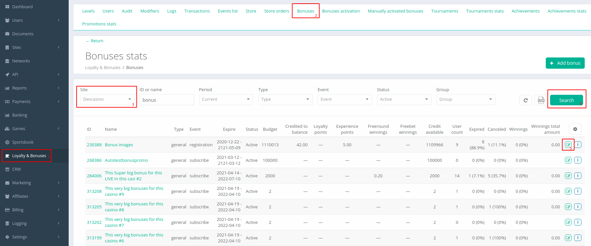
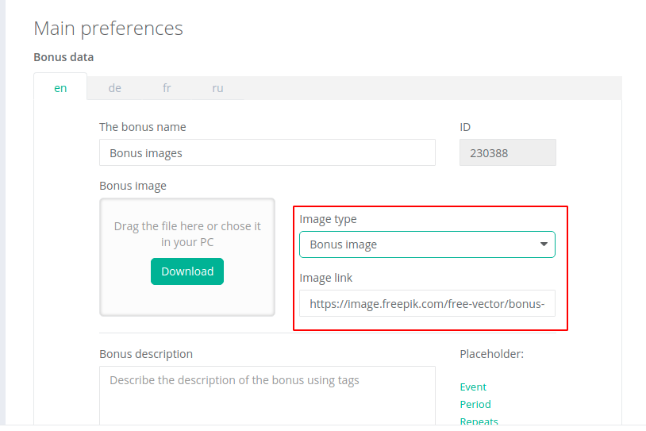
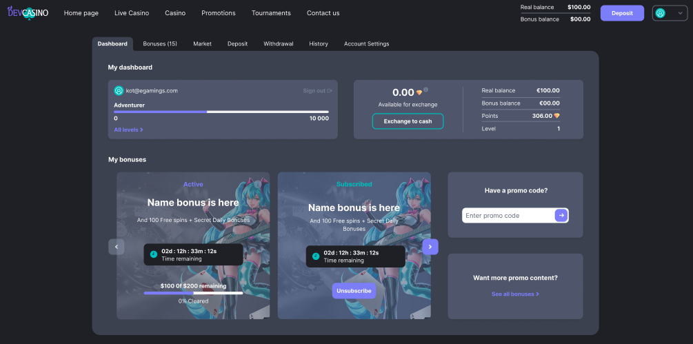
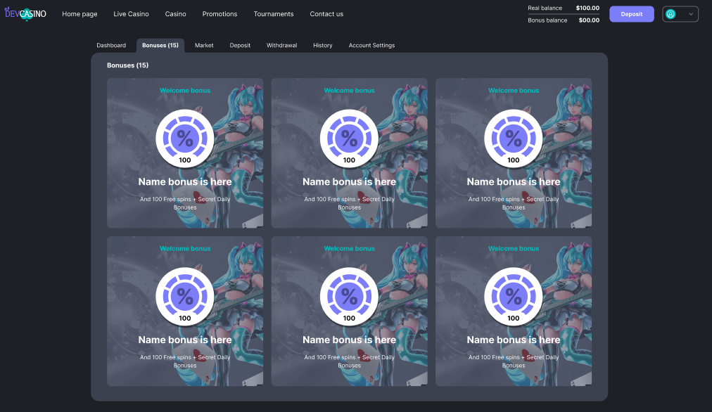
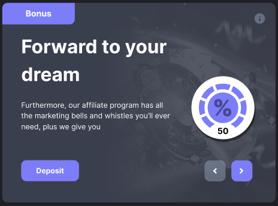
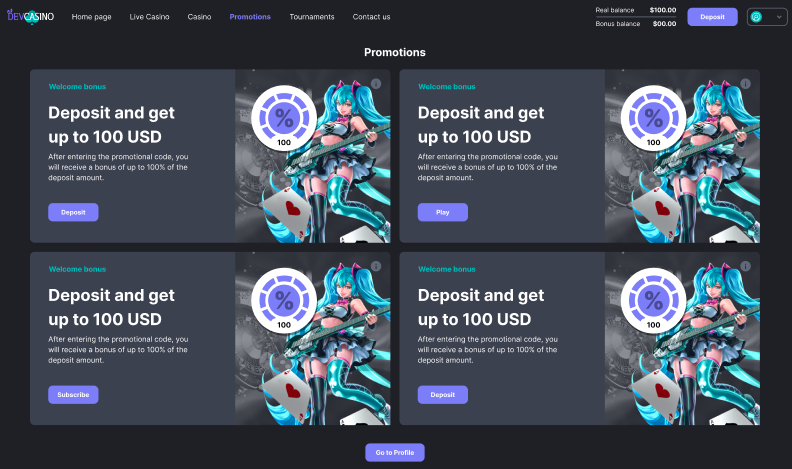
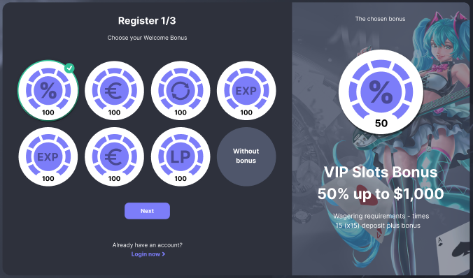
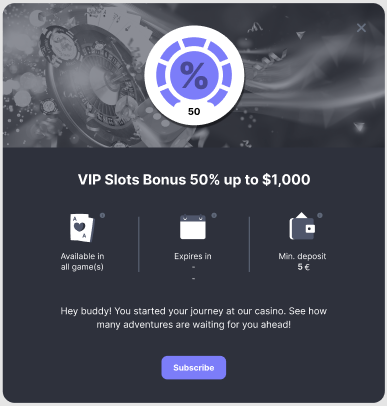

<ul class="nav nav-tabs" role="tablist">
    <li class="active">
        <a href="#english" role="tab" id="english-tab" data-toggle="tab" data-link="english">English</a>
    </li>
    <li>
        <a href="#russian" role="tab" id="russian-tab" data-toggle="tab" data-link="russian">Russian</a>
    </li>
</ul>

# English

# 8.5. Bonus images

## Fundist

Настройки изображений для бонусов производятся в Fundist. 
1. Заходим в настройки бонуса.

2. Выбираем тип изображения, вставляем ссылку на изображение и сохраняем изменения.

*Есть возможность вставлять разные изображения для каждого из языков подключеных на проекте.*

## Типы изображений
* Bonus image - фоновое изображение на карточке бонуса в дашборде профиля, разделе бонусы и на блоке бонусов на главной
* Promo - отображается в разделе Promotions
* Registration - показывается при выборе соответствующего бонуса при регистрации
* Store (WIP) - используется в шапке в модальном окне "подробней" о бонусе.
* Other (WIP) - пока не используется.

## Расположение на проекте

### Bonus image
   

 

### Promo

### Registration

### Store (WIP)

### Other (WIP)

