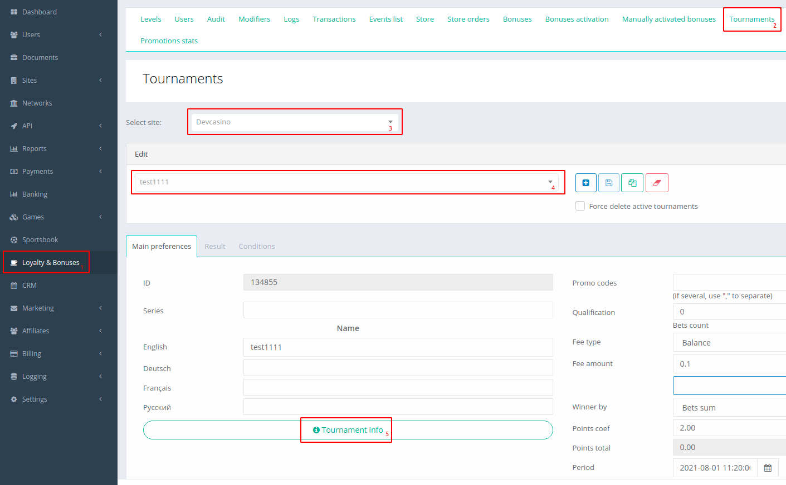
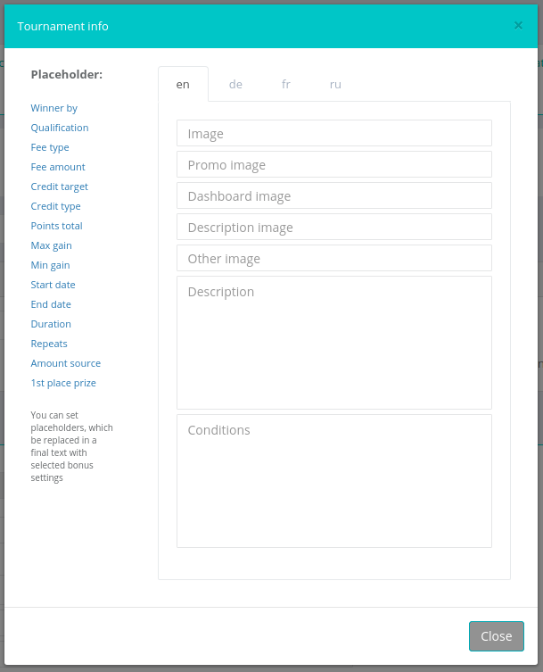
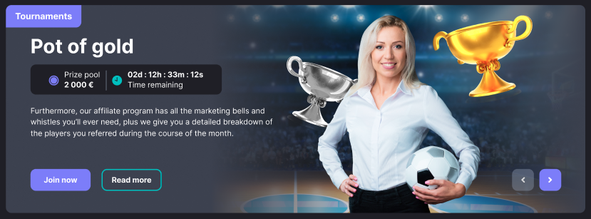
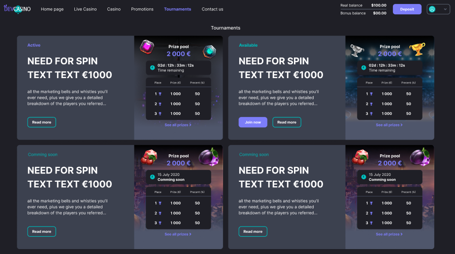
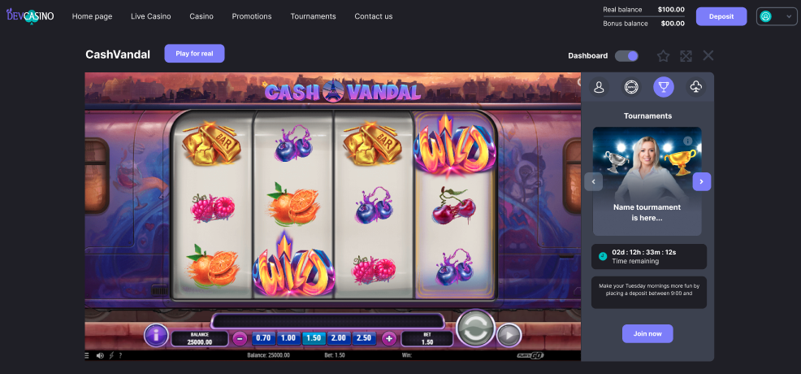
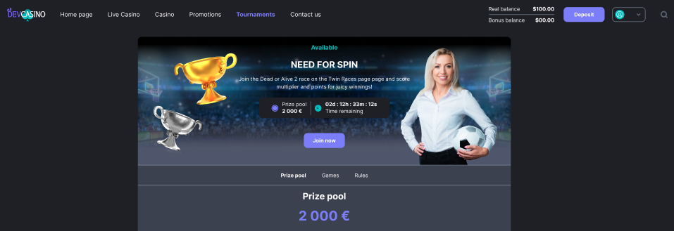
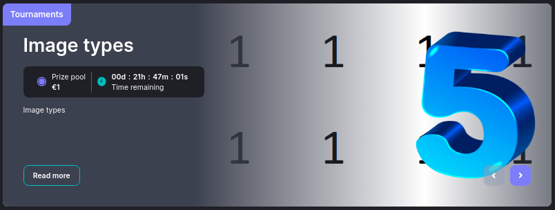

<ul class="nav nav-tabs" role="tablist">
    <li class="active">
        <a href="#english" role="tab" id="english-tab" data-toggle="tab" data-link="english">English</a>
    </li>
    <li>
        <a href="#russian" role="tab" id="russian-tab" data-toggle="tab" data-link="russian">Russian</a>
    </li>
</ul>

# English

# 8.6. Tournament images

Настройки изображений для турниров производятся в Fundist. 
1. Заходим в настройки турнира.

2. В соответствующие поля вставляем ссылки на изображения, закрываем модальное окно и сохраняем изменения.

*Есть возможность вставлять разные изображения для каждого из языков подключеных на проекте.*

## Типы изображений
* Image - фоновое изображение на карточке турнира для блока на главной странице
* Promo image - отображается в разделе Tournaments
* Dashboard image - предназначено для показа в дашборде игры.
* Description image - отображается при открытии модального окна с турниром.
* Other - декор для изображения бонуса на главной, отображается поверх изображения Image.

### Image

### Promo image 

### Dashboard image

### Description image

### Other

