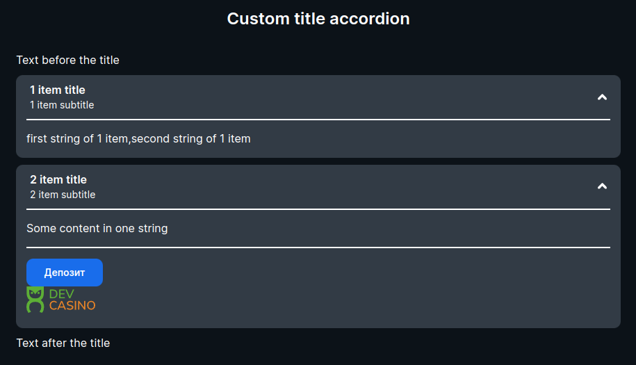
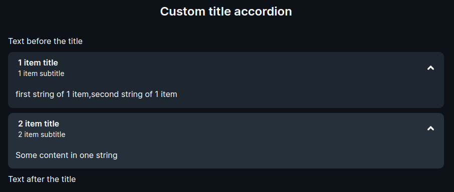

<ul class="nav nav-tabs" role="tablist">
    <li class="active">
        <a href="#english" role="tab" id="english-tab" data-toggle="tab" data-link="english">English</a>
    </li>
    <li>
        <a href="#russian" role="tab" id="russian-tab" data-toggle="tab" data-link="russian">Russian</a>
    </li>
</ul>
<div class="tab-content">
<div class="tab-pane fade active in" id="c-english">

# Accordion Component

#### Аккордеон представляет собой список элементов с заголовками, с возможностью раскрыть элемент для отображения описания

---

## Параметры

* **themeMod**: `'default | simple'` - Тема отображения

* **items**: `IAccordeonData[]` - Массив элементов компонента

    * **title**: `string` - Заголовок элемента

    * **description**: `string` - Подзаголовок элемента

    * **content**: `string[]` - Контент, отображаемый в развернутом виде

    * **wrapper**: `IWrapperCParams` - Обертка, для использования дополнительных компонентов

    * **expand**: `boolean` - Развернут ли элемент по умолчанию

* **collapseAll**: `boolean` - Свернуть все элементы

* **title**: `string` - Общий заголовок аккордеона

* **titleIconPath**: `string` - Путь к иконке расположенной в правой части элемента на уровне заголовка

* **textBefore**: `string[]` - Текст перед аккордеоном

* **textAfter**: `string[]` - Текст после аккордеона

* **isEmpty**: `boolean` - Пустой ли компонент (имеются ли элементы в компоненте). При значении `true` отображается `no-data`

---

### Дефолтные параметры

```ts
export const defaultParams: IAccordionCParams = {
    class: 'wlc-accordion',
    moduleName: 'core',
    titleIconPath: '/wlc/icons/arrow.svg',
};
```

---

### Пример использования компонента задействовав все параметры

```ts
{
                        name: 'core.wlc-accordion',
                        params: {
                            themeMod: 'default',
                            items: [
                                {
                                    title: '1 item title',
                                    description: '1 item subtitle',
                                    content: [
                                        'first string of 1 item',
                                        'second string of 1 item'
                                    ],
                                    expand: true,
                                },
                                {
                                    title: '2 item title',
                                    description: '2 item subtitle',
                                    content: [
                                        'Some content in one string'
                                    ],
                                    wrapper: {
                                        class: 'custom-wrapper-in-accordion',
                                        components: [
                                            componentLib.wlcButton.leftMenuDeposit,
                                            componentLib.wlcLogo.header,
                                        ],
                                    },
                                    expand: false,
                                },
                            ],
                            collabseAll: true,
                            title: 'Custom title accordion',
                            titleIconPath: '/wlc/icons/arrow.svg',
                            textBefore: ['Text before the title'],
                            textAfter: ['Text after the title'],
                            isEmpty: false,
                        },
                    }
```


---

### Пример, при параметре `themeMod: 'simple'`
#### Нет разделительной полосы в развернутом виде


---

### Пример, при параметре `isEmpty: true`


