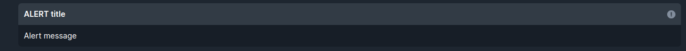
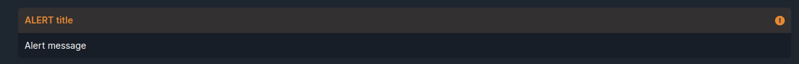
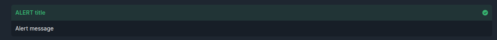
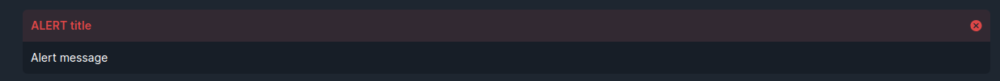

<ul class="nav nav-tabs" role="tablist">
    <li class="active">
        <a href="#english" role="tab" id="english-tab" data-toggle="tab" data-link="english">English</a>
    </li>
    <li>
        <a href="#russian" role="tab" id="russian-tab" data-toggle="tab" data-link="russian">Russian</a>
    </li>
</ul>
<div class="tab-content">
<div class="tab-pane fade active in" id="c-english">

# Alert Component
It displays a block with an alert and inserts icons corresponding to the type of warning.

## Params
Interface [ITransactionHistoryAlert](/docs/compodoc/interfaces/ITransactionHistoryAlert.html#info)

```html
<div *ngIf="[Condition]"
    wlc-alert
    [level]="'error'"
    class="{{$class}}"
    [title]="'ERROR'"
    [text]="'Alert message looks like this'">
</div>
```
```typescript
export const defaultParams: IAlertCParams = {
    class: 'wlc-alert',
    componentName: 'wlc-alert',
    moduleName: 'core',
    level: 'info',
};
```

- **level** - sets the style for alert ("info", "warning", "success", "error")
- **title** - title of alert
- **text** - text about alert's type

</div>
<div class="tab-pane fade" id="c-russian">

# Alert Component
Выводит блок с предупреждением и вставляет иконки соответствующие типу предупреждения.

## Параметры
Интерфейс [ITransactionHistoryAlert](/docs/compodoc/interfaces/ITransactionHistoryAlert.html#info)

- **level** - определяет стиль предупреждения ("info", "warning", "success", "error")
- **title** - заголовок предупреждения
- **text** - текст о типе предупреждения/действиях которые надо выполнить и т.п.

```html
<div *ngIf="[Condition]"
    wlc-alert
    [level]="'error'"
    class="{{$class}}"
    [title]="'ERROR'"
    [text]="'Alert message looks like this'">
</div>
```
```typescript
export const defaultParams: IAlertCParams = {
    class: 'wlc-alert',
    componentName: 'wlc-alert',
    moduleName: 'core',
    level: 'info',
};
```
##





</div>
</div>
