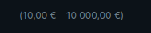
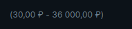
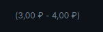

<ul class="nav nav-tabs" role="tablist">
    <li class="active">
        <a href="#english" role="tab" id="english-tab" data-toggle="tab" data-link="english">English</a>
    </li>
    <li>
        <a href="#russian" role="tab" id="russian-tab" data-toggle="tab" data-link="russian">Russian</a>
    </li>
</ul>
<div class="tab-content">
<div class="tab-pane fade active in" id="c-english">

# Amount-limit Component

#### Компонент устанавливает диапазон от минимального до максимального заданного значения, в выбранной валюте

---

### Параметры

* **minValue**: `number` - Минимальное значение

* **maxValue**: `number`- Максимальное значение

* **showLimits**: `boolean | ILimits` - Показывать лимиты, либо установить новые значения

    * **min**: `number` - Минимальное значение, перекрывает minValue
    * **max**: `number` - Максимальное значение, перекрывает maxValue

* **currency**: `string` - Валюта (USD, EUR, RUB etc)

---

### Дефолтные параметры, с включенными лимитами (по умолчанию выключены)

```ts
export const defaultParams: IAmountLimitCParams = {
    moduleName: 'core',
    class: 'wlc-amount-limit',
    componentName: 'wlc-amount-limit',
    minValue: 10,
    maxValue: 10000,
    showLimits: true, // - Default is false
};
```

---

### Кастомный вариант
```ts
{
    name: 'core.wlc-amount-limit',
    params: {
        minValue: 30,
        maxValue: 36000,
        showLimits: true,
        currency: 'RUB',
    },
}
```

---
### Перебиваем значения
```ts
{
    name: 'core.wlc-amount-limit',
    params: {
        minValue: 30,
        maxValue: 36000,
        showLimits: {
            min: 3,
            max: 4
        },
        currency: 'RUB',
    },
}
```

