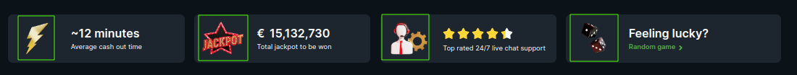

<ul class="nav nav-tabs" role="tablist">
    <li class="active">
        <a href="#russian" role="tab" id="russian-tab" data-toggle="tab" data-link="russian">Russian</a>
    </li>
    <li>
        <a href="#english" role="tab" id="english-tab" data-toggle="tab" data-link="english">English</a>
    </li>
</ul>

<div class="tab-content">
<div class="tab-pane fade active in" id="c-russian">

## Russian
---

</div>
<div class="tab-pane fade" id="c-russian">

# Animate-sprite component

#### Компонент позволяет анимировать картинку. В данный момент компонент может быть применен к секции `four-elements` анимируя выделенные картинки



#### Каждый из компонентов секции выше имеет параметр `useSprite: boolean`, по которому включается анимация. Чтобы анимировать все картинки - необходимо указать `useSprite: true` в каждом из четырех компонентов соответственно. По умолчанию во всех них параметр `useSprite` находится в значении `false`

---

## Параметры animate-sprite

* `imageUrl: string` - Путь к спрайту. Необходимо иметь в виду, что спрайт нарисован определенным образом, подкадрово в одном файле. Папка со спрайтами находится `static/root/sprites`

* `framesCount: number` - Количество кадров спрайта. В данный момент 4 спрайта имеют по 40 кадров, поэтому этот параметр по умолчанию имеет значение `40`

* `animateUntilMouseLeave: boolean` - Продолжать ли анимацию пока курсор находится на элементе

* `useEventsOnCanvas: boolean` - (если `false`)Активировать анимацию по событиям на родительский `host` элемент

* `interval: number` - Фактически скорость воспроизведения анимации. По умолчанию `35`. Чем ниже значение, тем быстрее проигрывается анимация

* `fullAnimatingCycle: boolean` - Использовать полный цикл анимации

* `autoAnimating` - Автоматически проигрывать анимацию
    * `use: boolean` - **Использовать параметр**
    * `intervalFrom: number` - минимальный интервал между анимациями
    * `intervalTo: number` - максимальный интервал между анимациями

* `resize` - Изменение размера спрайтов при изменении разрешения экрана (Например перевернуть планшет с альбомного на портретный)
    * `use: boolean` - Использовать параметр
    * `debounce: number` - Время через которое спрайты изменят размер в миллисекундах

* `intersection` - Анимировать спрайты, если они находятся вне поле зрения страницы
    * `use: boolean` - Использовать параметр
    * `intersectionSettings: IntersectionObserverInit`
        * `root: Element | Document | null` - Объект, который будет целью для запуска анимации. Если не указан - то анимация будет реагировать на всю область видимого документа
        * `rootMargin: string` - Значение определяет смещенение добавляемое к ограничивающему окну. По умолчанию 0.
        * `threshold: number | number[]` - принимает значение `0.0 - 1.0` определяя отношение площади пересечения к общей площади ограничивающей рамки для наблюдаемой цели. Более подробно об этом объекте [IntersectionObserver](https://developer.mozilla.org/en-US/docs/Web/API/IntersectionObserver/IntersectionObserver)

---

###  Дефолтные параметры
```ts
export const defaultParams = {
    moduleName: 'core',
    componentName: 'wlc-animate-sprite',
    class: 'wlc-animate-sprite',
    framesCount: 40,
    interval: 35,
    animateUntilMouseLeave: true,
    useEventsOnCanvas: true,
    fullAnimatingCycle: true,
    animationCycleCount: 2,
    autoAnimating: {
        use: true,
        intervalFrom: 6000,
        intervalTo: 12000,
    },
    resize: {
        use: true,
        debounce: 100,
    },
    intersection: {
        use: true,
        intersectionSettings: {
            threshold: 0.2,
        },
    },
};
```
### К сожалению, продемонстрировать варианты анимации невозможно ограниченными возможностями разметки Markdown
