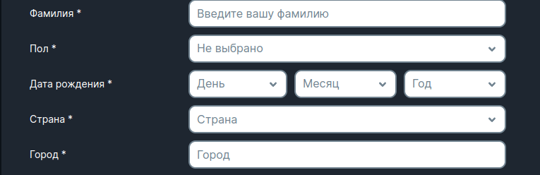

<ul class="nav nav-tabs" role="tablist">
    <li class="active">
        <a href="#russian" role="tab" id="russian-tab" data-toggle="tab" data-link="russian">Russian</a>
    </li>
    <li>
        <a href="#english" role="tab" id="english-tab" data-toggle="tab" data-link="english">English</a>
    </li>
</ul>

<div class="tab-content">
<div class="tab-pane fade active in" id="c-russian">

## Russian
---

</div>
<div class="tab-pane fade" id="c-russian">

# Birthday-field component

#### Компонент является оболочкой трех `select`-компонентов для установки даты рождения: дня, месяца и года

#### Конфигурация дня, месяца и года задаётся через интерфейс [ISelectCParams](../select/select.params.ts)

```ts
    birthDay: ISelectCParams,
    birthMonth: ISelectCParams,
    birthyear: ISelectCParams
```

###### Подробнее про [Select компонент](../select/select.components.md)

#### Параметры самого компонента формируются в [FormElements](../../system/config/form-elements.ts) в переменной `birthDate`, и подключаются в *namespace* - wlcProfileForm

---
## Дефолтные параметры компонента:

```ts
export const defaultParams: Partial<IBirthFieldCParams> = {
    class: 'wlc-birth-field',
    birthDay: {
        labelText: gettext('Date of birth'),
        wlcElement: 'block_day',
        customMod: 'day',
        common: {
            placeholder: gettext('Day'),
        },
        locked: true,
        name: 'birthDay',
        validators: ['required'],
        options: 'birthDay',
    },
    birthMonth: {
        wlcElement: 'block_month',
        customMod: 'month',
        common: {
            placeholder: gettext('Month'),
        },
        locked: true,
        name: 'birthMonth',
        validators: ['required'],
        options: 'birthMonth',
    },
    birthYear: {
        wlcElement: 'block_year',
        customMod: 'year',
        common: {
            placeholder: gettext('Year'),
        },
        locked: true,
        name: 'birthYear',
        validators: ['required'],
        options: 'birthYear',
    },
};
```

### Используется обычно в профиле и форме регистрации:

---

