<ul class="nav nav-tabs" role="tablist">
    <li>
        <a href="#english" role="tab" id="english-tab" data-toggle="tab" data-link="english">To English</a>
    </li>
</ul>
<div class="tab-content">

<div class="tab-pane fade active" id="c-russian">

## Russian

<font size =5>

# Burger-Panel Component

Боковая панель разделена на:

     Header

<font size =3>

Включает в себя **`заголовок`**, **`лого`**, **`кнопки навигации`** (в мобильном меню) и **`кнопка скрытия панели`**

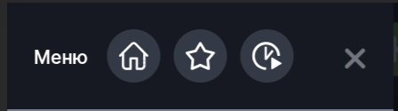


<font size =5>

    Content

<font size =3>

Включает в себя модули **`логин/регистрация`** (для незалогиненного пользователя), **`информация о пользователе`** (user-info, для залогиненного пользователя), модуль **`главное меню`** (main-menu), **`блок с постами`** (ссылки на странцы в WordPress), **`кнопка выбора языка`**, **`ссылки на соцсети`**.\
_*содержимое блока может настраиваться конфигами_

<font size =4>
При инициализации **компонента** происходит определение параметров бургер-панели

- `isFixed` - расположение панели ('_left-fixed_' | '_right-fixed_')
- `useFixedPanel` - используется ли панель (_boolean_)
- `animeType` - в зависимости от выбранной темы задается тип анимации

добавление модуля _`'menu'`_

подписка на эвент закрытия панели при переходе в другое меню при логине или разлогине пользователя

<font size =5>

## Типы отображения

<font size =3>

_* далее примеры указаны для варианта отображения_ **СЛЕВА**!!!

- ### Базовая ('left' | 'right')

<table>
   <thead>
        <tr>
            <th>Close</th>
            <th>Open</th>
        </tr>
    </thead>
    <tbody>
        <tr>
            <td style="padding-right:40px;">
                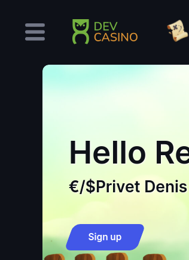
            </td>
                        <td>
                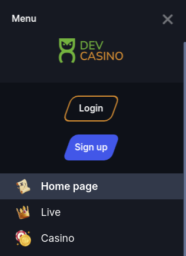
            </td>
        </tr>
    </tbody>
</table>

___

- ### Фиксированная ('left-fixed' | 'right-fixed')

<table>
   <thead>
        <tr>
            <th>Close</th>
            <th>Open</th>
        </tr>
    </thead>
    <tbody>
        <tr>
            <td style="padding-right:40px;">
                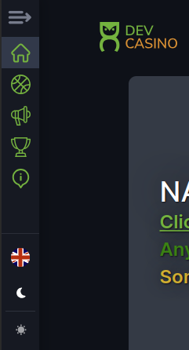
            </td>
                        <td>
                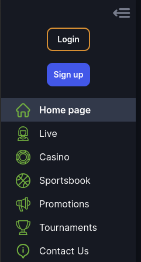
            </td>
        </tr>
    </tbody>
</table>

___
- ### Wolf ('left-fixed' | 'right-fixed')

*_включается при теме WOLF_

<table>
   <thead>
        <tr>
            <th>Close</th>
            <th>Open</th>
        </tr>
    </thead>
    <tbody>
        <tr>
            <td style="padding-right:40px;">
                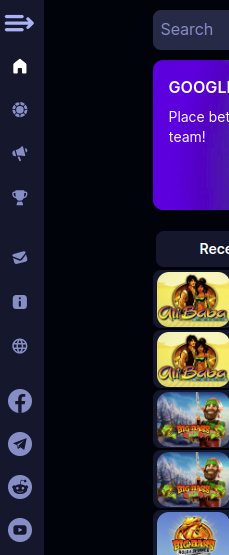
            </td>
                        <td>
                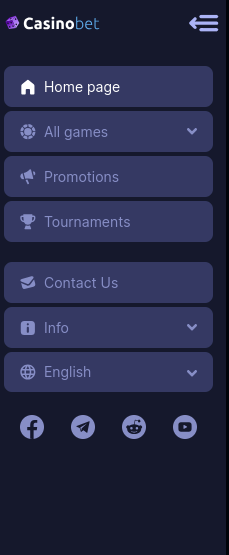
            </td>
        </tr>
    </tbody>
</table>

___

<font size =5>

## Типы анимации

<font size =3>

* `fade` - изменение затемнения одновременно всей панели. Панель "выезжает" почти полностью, затем начинает изменяться затемнение. Базовая анимация
* `fade-stagger` - изменение затемнения элементов панели последовательное (сверху вниз)
* `translate-stagger` - последовательное отображение элементов панели (сверху вниз)
* `scale-stagger` - изменение затемнения одновременно всей панели. Затемненияе начинает изменяться сразу как панель начинает "выезжать".

<font size =5>

## Входящие параметры

<font size =3>

```TypeScrypt
export const defaultParams: IBurgerPanelCParams = {
    moduleName: 'core',
    componentName: 'wlc-burger-panel',
    class: 'wlc-burger-panel',
    type: 'left',
    showHeader: true,
    useScroll: true,
    showClose: true,
    animeType: 'scale-stagger',
    touchEvents: {
        use: true,
    },
};
```
- `type` - Тип отображаемой панели
- `animeType` - Тип анимации появления бургер панели
- `showHeader` - отображение заголовка Меню и пунктов заголовка для мобильных устройств
<table>
   <thead>
        <tr>
            <th>true</th>
            <th>false</th>
        </tr>
    </thead>
    <tbody>
        <tr>
            <td style="padding-right:40px;">
                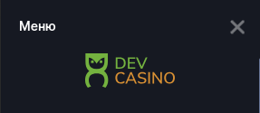
            </td>
                        <td>
                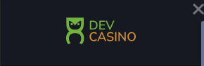
            </td>
        </tr>
    </tbody>
</table>

- `showClose` - отображение иконки закрытия панели ("Х")
- `useScroll` - добавляет вертикальный скрол-бар

<table>
   <thead>
        <tr>
            <th>true</th>
            <th>false</th>
        </tr>
    </thead>
    <tbody>
        <tr>
            <td style="padding-right:40px;">
                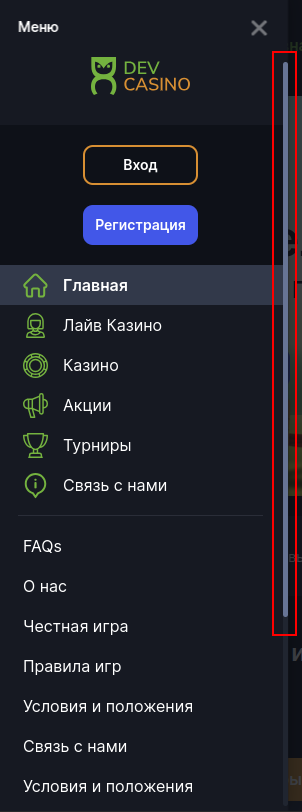
            </td>
                        <td>
                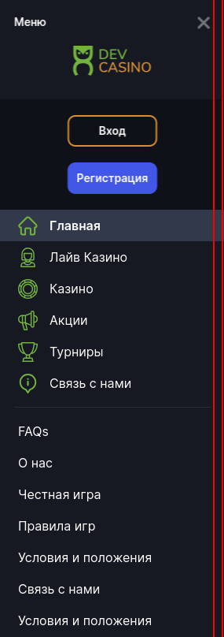
            </td>
        </tr>
    </tbody>
</table>

- `touchEvents` - отключает возможность касанием  скролить вертикально бургер-панель на мобильных устройствах.\
_*планировалось/планируется использовать в связке с hummerjs для эффектов скроллинга на десктопе_

<font size =3>


## English

<ul class="active">
    <li>
        <a href="#russian" role="tab" id="russian-tab" data-toggle="tab" data-link="russian">To Russian</a>
    </li>
</ul>
