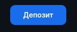
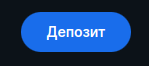
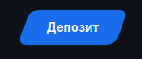
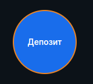
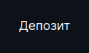
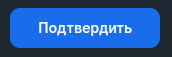
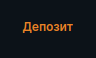
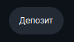
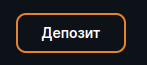

<ul class="nav nav-tabs" role="tablist">
    <li class="active">
        <a href="#russian" role="tab" id="russian-tab" data-toggle="tab" data-link="russian">Russian</a>
    </li>
    <li>
        <a href="#english" role="tab" id="english-tab" data-toggle="tab" data-link="english">English</a>
    </li>
</ul>
<div class="tab-content">

<div class="tab-pane fade active" id="c-russian">

## Russian

# Button component

Компонент выводит кнопку.

## Параметры
* **theme** - Тема для стилизации кнопки `('default' | 'skew' | 'rounding' | 'circled' | 'borderless' | 'icon' | 'cleared' | 'resolve'
    | CustomType)`

---

* **themeMod** - Модификация кнопки `('default' | 'secondary' | 'readmore' | 'textonly' | CustomType)`

---

* **type** - Тип кнопки `('default' | 'resolved' | 'rejected' | 'pending' | 'disabled' | CustomType)`

---

* **modifiers**: `Modifiers[]` - Собирает модификаторы классов из `common.size`, `common.customModifiers`, `common.animation`. Не конфигурируется.

---

* **pending$**: `BehaviorSubject<boolean>` - Подписка на "готовность" кнопки

---

* **pendingIconPath**: `string` - Иконка ожидания, во время загрузки "готовности" кнопки

---

* **common** :
    * **size**: `Size` - дополнительный CSS-модификатор. Значение данного поля будет отражено в дополнительном классе кнопки, например:  `size: 'small'` => `class="wlc-btn--size-small"`

    * **icon**: `string` - Иконка, которая будет выведена на кнопке

    * **iconPath**: `string` - Путь к иконке, которая будет выведена на кнопке

    * **index**: `Index` - (Deprecated) В компоненте никакой логики не делает

    * **text**: `string` - Текст надписи на кнопке

    * **customModifiers**: `CustomMod` - Добавляет кастомный класс модификатор главному родительскому тэгу `button`

    * **event**: `EventType | EventType[]` - событие или массив событий, которые возникнут при клике на кнопку

    * **href**: `string` - Переход по заданному url пути

    * **hrefTarget**: `THrefTarget` - Переход по ссылке в заданном окне или фрейме

    * **sref**: `string` - стейт, на который будет осуществлен переход по нажатию на кнопку

    * **srefParams**: `RawParams` - параметры стейта, которые будут переданы при нажатии кнопки.

    * **typeAttr**: `string` - Создает атрибут на родительском элементе `type` с введенным значением `type="[customtext]"`

    * **counter**: `CounterType` - Вставляет число в кнопку после текста
        * **use**: `boolean` - Использовать параметр
        * **value**: `number` - Числовое значение

    * **wlcElement**: `string` - значение аттрибута data-wlc-element, использующегося в автотестах

    * **animation**: `TButtonAnimation` - Анимирует кнопку
        * **type**: `'pulse' | CustomType` - Тип анимации
        * **handlerType**: `'deposit' | 'click'` - Тип события, останавливающий анимацию

    * **selectorScroll**: `string` - Селектор, до которого произойдет автоматичский скролл

---

## Пример конфига

```ts
export const defaultParams: IButtonCParams = {

    class: 'wlc-btn wlc-btn-custom',
    theme: 'rounding',
    common: {
        iconPath: '/wlc/icons/jackpots.svg',
        text: 'Jackpots',
        size: 'default',
        sref: 'app.customState',
        srefParams: {
            category: 'casino',
            childCategory: 'jackpots',
        },
        event: {
                name: 'SHOW_MODAL',
                data: 'search',
        },

    },
};
```

## Примеры отображения состояний

**theme='default' & themeMod='default'**



**theme='rounding'**



**theme='skew'**



**theme='circled'**



**theme='icon' - в данном примере иконка депозита для мобильных устройств**

.png)

**theme='borderless'**



**theme='resolve'**



**theme='theme-wolf-link'**



**theme='wolf-rounded'**



**themeMod='secondary'**



# English
