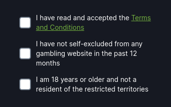
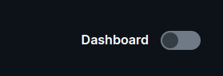
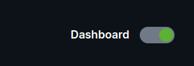

<div class="tab-content">
<div class="tab-pane fade active" id="c-russian">

## Russian

<ul class="nav nav-tabs" role="tablist">
    <li>
        <a href="#english" role="tab" id="english-tab" data-toggle="tab" data-link="english">To English</a>    </li>
</ul>

<font size =5>

# Checkbox Component

<font size =4>

При инициализации **компонента** первоначально происходит проверка состояния чекбокса и присвоение ему типа.
Затем запускается слушатель изменений состояния чекбокса и формируется CSS-класс в зависимости от состояния.
При типе чекбокса `"Age"` определяется актуальный минимальный для регистрации возраст.
Добавляются модификаторы для классов и добавляется слушатель изменения модификаторов. Инициализируется значение для `textContext`. В зависимости от переданного `checkboxType`, определяются  свойства `checkboxType`, `textWithLink`, `textContext` для текущего чекбокса.

<font size =5>

## Темы

<font size =3>

- ### `'default'`

 _Стандартные стили для чекбокса_

- ### `CustomType = "custom"`

_Используется для переопределения стилей чекбокса на проекте_

- ###  ~~`'mobile-app'`~~  -  deprecated

<font size = 5>

## Типы отображения

<font size =3>

### `Default`

применяется:

- модальное окно регистрации
- верификация в профиле
- модальное окно New T&C



### `Toggle`

применяется:

- Дашборд игры

 


<font size =5>

## Входящие параметры

<font size =3>

```TypeScrypt
export interface ICheckboxCParams extends IComponentParams<ComponentTheme, ComponentType, string> {
    name?: string;
    value?: string;
    checkboxType?: CheckboxType;
    validators?: ValidatorType[];
    text?: string;
    textSide?: TextSide;
    /* for checkbox for legal rules with link inside */
    textWithLink?: ILegalCheckboxWithLink;
    /* context for text translate */
    textContext?: IIndexing<string | number>;
    control?: UntypedFormControl;
    onChange?: OnChange,
    common?: {
        customModifiers?: CustomMod;
        checkedDefault?: boolean;
    }
    modifiers?: Modifiers[];
}

export const defaultParams: ICheckboxCParams = {
    class: 'wlc-checkbox',
    moduleName: 'core',
    componentName: 'wlc-checkbox',
    common: {
        checkedDefault: false,
    },
};
```


- `name`: принимает компонент - _'core.wlc-checkbox'_;
- `value`: принимает состояние чекбокса ( **true** | **false**);
- `checkboxType`: принимает _строку_ ("age","terms", "privacy-policy", ...), определяет исполюзуемый темплейт чекбокса;
- `validators` : принимает массив строк, элементы которого являются ключами объекта _`validatorList`_ класса _`ValidationService`_;
- `text`: принимает текст, отображаемый рядом с чекбоксом;
- `textSide`: приимает сроки 'left' | 'right'. Определяет расположение текста относительно чекбокса;
- `textWithLink`: переопределяет параметр `text` расширяется интерфейсом `ILegalCheckboxWithLink`, который позволяет формировать и добавлять ссылки внутри текста;
- `textContext`: принимает `число` или `строку`, нужен для работы с переводами и .po файлами;
- `control`: принимает тип контролера из angular/forms; задаётся автоматически при инициализации компонента;
- `onChange`: принимает колбэк-функцию, вызываемую при изменении `value` чекбокса; применяется для изменения параметров используемых в других компонентах; _ПРИМЕР_: при активном чекбоксе появляется инпут;
- `common`: принимает объект с двумя параметрами:
        `customModifiers`: принимает `строку`, используемую как модификатор для измененеия стилей;
        `checkedDefault`: принимает `boolean`, используется для принудительной активации чекбокса при инициализации компонента
- ~~`modifiers`~~ depricated

## English

<ul class="nav nav-tabs" role="tablist">
    <li class="active">
        <a href="#russian" role="tab" id="russian-tab" data-toggle="tab" data-link="russian">To Russian</a>
    </li>
</ul>
