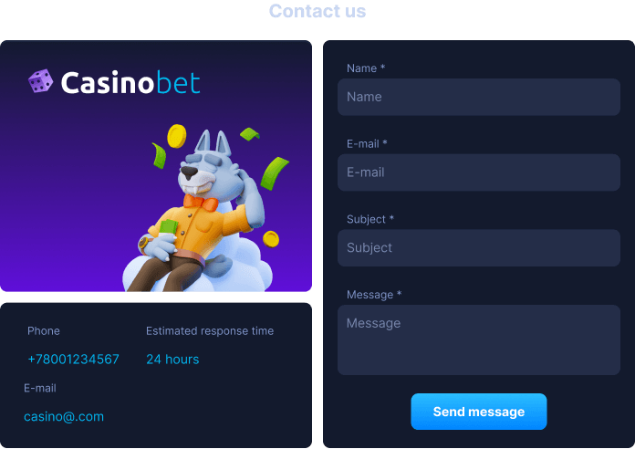

<ul class="nav nav-tabs" role="tablist">
    <li>
        <a href="#english" role="tab" id="english-tab" data-toggle="tab" data-link="english">English</a>
    </li>
        <li class="active">
        <a href="#russian" role="tab" id="russian-tab" data-toggle="tab" data-link="russian">Russian</a>
    </li>
</ul>


### Russian

<div class="tab-content">

<div class="tab-pane fade active" id="c-russian">

# Contact-us-page Component

Компонент подключается в `'Theme: Wolf'` и заменяет собой компонент **`feedback-form.component`**

Отвечает за отображение полей контактов. Включает номер телефона, адрес электронной почты, время работы службы поддержки и форму для отправки сообщений.

## Отображение




## Входящие параметры

```typescript
export interface IContactUsPageCParams extends IComponentParams<ComponentTheme, ComponentType, string> {
    imgPath?: string;
}

export const defaultParams: IContactUsPageCParams = {
    moduleName: 'core',
    componentName: 'wlc-contact-us-page',
    class: 'wlc-contact-us-page',
    imgPath: 'static/images/feedback.png',
};
```

- `'imgPath'` - путь до изображения для бэкграунда блока с логотипом

### English
