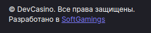
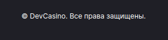

<ul class="nav nav-tabs" role="tablist">
    <li class="active">
        <a href="#russian" role="tab" id="russian-tab" data-toggle="tab" data-link="russian">Russian</a>
    </li>
    <li>
        <a href="#english" role="tab" id="english-tab" data-toggle="tab" data-link="english">English</a>
    </li>
</ul>

<div class="tab-content">
<div class="tab-pane fade active in" id="c-russian">

## Russian
---

</div>
<div class="tab-pane fade" id="c-russian">

# Copyright component
Компонент выводит текст копирайта на сайте. Текст по умолчанию:


**© [SiteName]. Все права защищены.**


**Разработано в SoftGamings**

---

## Параметры
Собственных параметров у компонента нет, при этом он использует параметры, указанные полях объекта ```{site}``` переменной ```$base``` из файла конфига проекта ```config/frontend/01.base.config.ts```:

```name``` - имя сайта, которое будет использовано при выводе текста копирайта;

```removeCreds``` (boolean) - следует ли убирать упоминание Sofgtamings из текста копирайта.

## Пример конфига (config/frontend/01.base.config.ts)

```typescript
export const $base: IBaseConfig = {
    site: {
        name: 'DevCasino',
        removeCreds: true,
    },
}
```

## Варианты отображения компонента:
### ```default:```


### ```removeCreds: true:```



</div>
</div>
