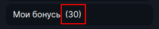
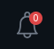
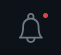

<ul class="nav nav-tabs" role="tablist">
    <li class="active">
        <a href="#russian" role="tab" id="russian-tab" data-toggle="tab" data-link="russian">Russian</a>
    </li>
    <li>
        <a href="#english" role="tab" id="english-tab" data-toggle="tab" data-link="english">English</a>
    </li>
</ul>

<div class="tab-content">
<div class="tab-pane fade active in" id="c-russian">

## Russian

# Counter Component

Счётчик, отображает количество элементов в полученном списке объектов.

реализован в компонентах:
- [menu.component](../../../../modules/menu/components/menu/menu.component.html)
- [internal-mails-notifier.component](../../../../modules/internal-mails/components/internal-mails-notifier/internal-mails-notifier.component.html)

## Варианты Отображения

    type Theme = 'default'



    type Theme = 'circle'



    type Theme = 'dot'



## Параметры
```ts
type Theme //  отвечает за общие стили компонента
```

```ts
type Type // параметр отвечающий за получение и фильтрацию элементов определенного типа
```

- type Type =  'bonuses-all' | 'bonuses-main'  - считает количество бонусов по условию:

```ts
 if (
    this.$params.type === 'bonuses-all' ||
    this.configService.get<boolean>('$bonuses.showAllInProfile')
) {
    filter = 'all';
} else if (this.$params.type === 'bonuses-main') {
    filter = 'main';
}
```

- type Type =  `'store'`  - **break**
- type Type =  `'tournaments'`  - **break**
- type Type =  `'internal-mails'` - получает и считает количество входящих сообщений;

```ts
type ThemeMod
```

'default' | 'internal-mails' |

### Дефолтные параметры

```ts
export interface ICounterCParams extends IComponentParams<Theme, Type, ThemeMod> {
    hideIfZero?: boolean;
}

export const defaultParams: ICounterCParams = {
    moduleName: 'core',
    componentName: 'wlc-counter',
    class: 'wlc-counter',
};
```

- `hideIfZero` - скрывает счетчик при количестве сообщений равном 0;


## English

<ul class="nav nav-tabs" role="tablist">
    <li class="active">
        <a href="#russian" role="tab" id="russian-tab" data-toggle="tab" data-link="russian">Russian</a>
    </li>
</ul>

# Counter Component

## View

## Params
