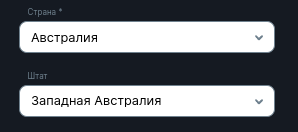
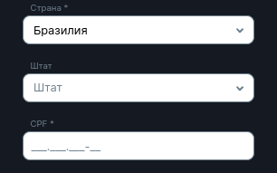
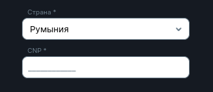

<ul class="nav nav-tabs" role="tablist">
    <li class="active">
        <a href="#english" role="tab" id="english-tab" data-toggle="tab" data-link="english">English</a>
    </li>
    <li>
        <a href="#russian" role="tab" id="russian-tab" data-toggle="tab" data-link="russian">Russian</a>
    </li>
</ul>
<div class="tab-content">
<div class="tab-pane fade active in" id="c-english">

# Country-and-state Component

#### Компонент реализовывает выбор страны и (при наличии) штата/федеральной области


---

## Параметры

* **countryCode**: `ISelectCParams` - Выбор страны. Реализовывает `Select` компонент. Ниже ссылка на документацию

* **stateCode**: `ISelectCParams` - Выбор штата. Реализовывает `Select` компонент. Ниже ссылка на документацию

* **cpf**: `IInputCParams` - Индивидуальный номер налогоплательщика Бразилии. Используется если страна выбрана Бразилия. Реализовывает `Input` компонент. Ниже ссылка на документацию

* **cnp**: `IInputCParams` - Личный цифровой код гражданина Румынии. Поле появляется при установленной лицензии Romania и предвыбранной страной Румынии. Реализовывает `Input` компонент. Ниже ссылка на документацию

---

#### [Select component](../select/select.components.md) - Документация `Select` компонента

#### [Input component](../input/input.component.md) - Документация `Input` компонента

---
### Дефолтные параметры

```ts
export const defaultParams: Partial<ICountryAndStateCParams> = {
    class: 'wlc-country-and-state',
    componentName: 'wlc-country-and-state',
    moduleName: 'core',
    countryCode: {
        labelText: gettext('Country'),
        common: {
            placeholder: gettext('Country'),
        },
        name: 'countryCode',
        validators: ['required'],
        options: 'countries',
        wlcElement: 'block_country',
        customMod: ['country'],
        useSearch: true,
        insensitiveSearch: true,
        noResultText: gettext('No results available'),
        autocomplete: 'new-password',
    },
    stateCode: {
        labelText: gettext('State'),
        common: {
            placeholder: gettext('State'),
        },
        name: 'stateCode',
        options: 'countryStates',
        wlcElement: 'block_state',
        customMod: ['state'],
    },
    cpf: _cloneDeep(FormElements.cpf.params),
    cnp: _cloneDeep(FormElements.cnp.params),
};
```
---

#### Далее поля cpf и cnp требуют:
`01.base.config.ts`
```ts
export const $base: IBaseConfig = {
    profile: {
        autoFields: {
            cpf: {
                use: true
            }
        }
    }
}
```
`0.site.config.php`
```ts
$cfg['registerUniqueCPF'] = true;
```
---
### Пример с выбраной страной Бразилия



### Пример с выбраной страной Румынии


