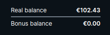
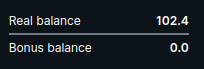
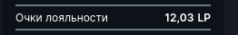

<ul class="nav nav-tabs" role="tablist">
    <li class="active">
        <a href="#russian" role="tab" id="russian-tab" data-toggle="tab" data-link="russian">Russian</a>
    </li>
    <li>
        <a href="#english" role="tab" id="english-tab" data-toggle="tab" data-link="english">English</a>
    </li>
</ul>
<div class="tab-content">

<div class="tab-pane fade active" id="c-russian">

## Russian
Компонент выводит значение валюты

## Темы отображения

### Default



## Параметры

* **value**:`number | string` - Параметр отображает установленное значение в качестве суммы, баланса, стоимости товара и т.д.

* **currency**:`string` - Устанавливает валюту. Если параметр не использовать, или указать в качестве значения `null` или `undefined` - то используется валюта примененная в `01.base.config.ts`. По умолчанию установлена `EUR`. Стоит иметь в виду, что *выбранная валюта пользователя при регистрации* на данный компонент не влияет, если к параметру конкретно не привязать валюту пользователя

```ts
export const $base: IBaseConfig = {
    defaultCurrency: 'USD',
}
```

* **digitsInfo**:`string` - вид отображения значения. По умолчанию `1-2-2`

    * Первая цифра - минимальное количество цифр ДО десятичной точки
    * Вторая цифра - минимальное количество цифр ПОСЛЕ десятичной точки
    * Третья цифра - максимальное количество цифр ПОСЛЕ десятичной точки

* **showIconOnly**:`boolean` - Параметр устанавливает в качестве значения только символ валюты

* **useSvgIconName**:`boolean` - Использовать имя иконки вместо иконки(пример использования ниже)

* **textError**:`string` - Текст в случае ошибки загрузки баланса

* **showValueOnly**:`boolean` - Параметр устанавливает в качестве значения только число, без символа валюты

---

## Дефолтные параметры
```ts
export const defaultParams: ICurrencyCParams = {
    class: 'wlc-currency',
    componentName: 'wlc-currency',
    moduleName: 'core',
    value: 0,
    digitsInfo: '1-2-2',
    showIconOnly: false,
    textError: gettext('Loading'),
    showValueOnly: false,
};
```
## Пример настройки компонента

`config/frontend/04.modules.config.ts`

```ts
export const $modules = {
    core: {
        components: {
            'wlc-currency': {
                digitsInfo: '1-1-1',
                showValueOnly: true,
            },
        },
    },
};
```
### И результат на сайте


---
### Использование имени иконки вместо самой иконки
#### Необходимо передать Input параметрами два свойства: <br> `[hideSvgName]='false'` <br> `[useSvgIconName]='true'`
```html
<span wlc-currency
        [currency]="shownUserStats[item].currency"
        [value]="shownUserStats[item]?.value"
        [hideSvgName]="false"
        [useSvgIconName]="true"
></span>
```


