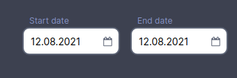

<ul class="nav nav-tabs" role="tablist">
    <li class="active">
        <a href="#russian" role="tab" id="russian-tab" data-toggle="tab" data-link="russian">Russian</a>
    </li>
    <li>
        <a href="#english" role="tab" id="english-tab" data-toggle="tab" data-link="english">English</a>
    </li>
</ul>
<div class="tab-content">

<div class="tab-pane fade active" id="c-russian">

## Russian

# Datepicker

Компонент позволяет выбрать определенный временной промежуток либо просто дату.

## Темы отображения

### Default




## Параметры

`iconPath` - путь на gstatic к иконке, которая будет выведена внутри инпута у компонента

---

`name` - задаёт имя элемента отправляемой формы

---

`label` - значение параметра будет использовано в качестве подписи к инпуту компонента.

---

`control` - Отслеживает значение и статус проверки отдельного элемента управления формы. Более подробно параметр описан по <a href="https://angular.io/api/forms/FormControl" target="_blank">ссылке</a>

---

`datepickerOptions` - опции, описанные в интерфейсе IAngularMyDpOptions. Полный список и примеры доступны по <a href="https://github.com/kekeh/angular-mydatepicker#options-attribute" target="_blank">ссылке</a>.

---


`defaultMonth` - если значение присутствует, при открытии календаря он позиционируется на месяце и году, указанных в данном параметре.
Пример: `'08/2019'`, `'08-2019'`.

Подробности и примеры использования см. по <a href="https://github.com/kekeh/angular-mydatepicker#defaultmonth-attribute" target="_blank">ссылке</a >

---


## Пример настройки параметров

`config/frontend/02.layouts.config.ts`

```ts
component: {
    params: {
        iconPath: 'wlc/icons/custom-icon.svg',
        label: 'From:',
        datepickerOptions: {
            dateFormat: 'mm.dd.yy',
            disableSince: {
                year: 2019,
                month: 12,
                day: 31,
            },
        },
    },
},

```


</div>


</div>


</div>

<hr>
<br />
<br />
<br />

<div class="tab-pane fade" id="c-english">

# English


