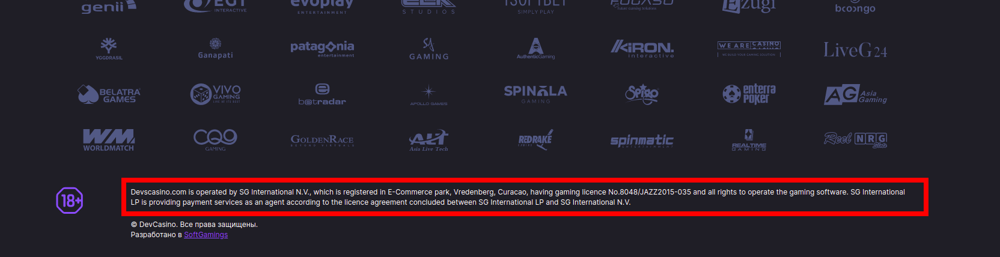
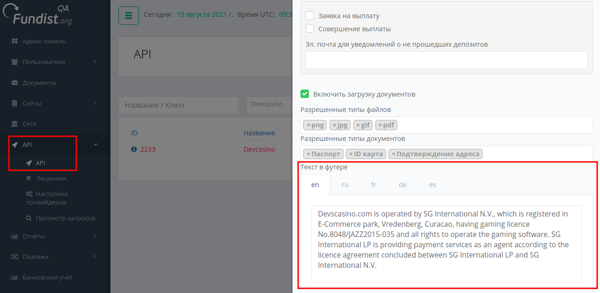

<ul class="nav nav-tabs" role="tablist">
    <li class="active">
        <a href="#russian" role="tab" id="russian-tab" data-toggle="tab" data-link="russian">Russian</a>
    </li>
    <li>
        <a href="#english" role="tab" id="english-tab" data-toggle="tab" data-link="english">English</a>
    </li>
</ul>

## Russian

# Disclaimer component

Компонент отображает текст дисклеймера в футере сайта. 
## Пример отображения

 
 

## Параметры

Собственных параметров компонент не имеет.

## Описание работы

 Текст для дисклеймера компонент получает из Fundist'а.

 Сам текст задаётся в API проекта:

При отсутствии текста для конкретного языка (не английского), компонент вставляет текст из английского варианта дисклеймера.

