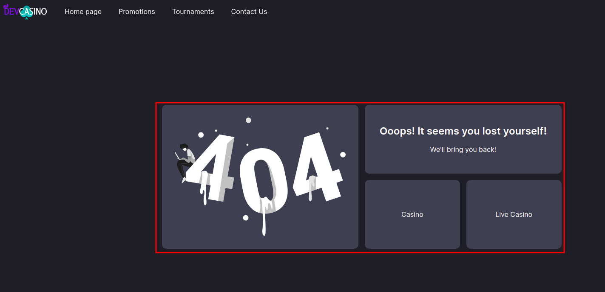
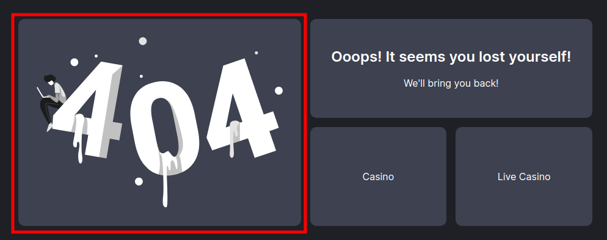
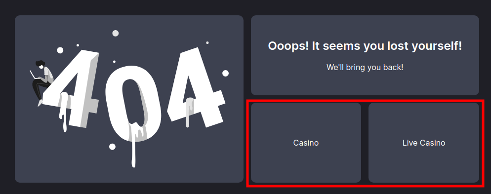

<ul class="nav nav-tabs" role="tablist">
    <li>
        <a href="#russian" role="tab" id="russian-tab" data-toggle="tab" data-link="russian">Russian</a>
    </li>
        <li class="active">
        <a href="#english" role="tab" id="english-tab" data-toggle="tab" data-link="english">English</a>
    </li>
</ul>
<div class="tab-content">
<div class="tab-pane fade active in" id="c-russian">

## Russian
</div>
<div class="tab-pane fade" id="c-russian">

# Error page component

Компонент позволяет настроить отображение страницы 404.

## Общий вид компонента

<br />

## Параметры
```image``` - указывает url изображения, которое будет использовано в качестве основного изображения для 404 страницы.
Путь к изображению в проекте указывается относительно каталога **root/static/images**.

По умолчанию используется изображение *gstatic/wlc/icons/404-error.svg*
<br />

<br />


```links``` - список ссылок на разделы сайта, которые будут выведены при отображении 404 страницы. Максимальное количество отображаемых ссылок ограничено 2 шт.




## Настройка параметров
Производится в файле ```config/frontend/04.modules.config.ts```:
```typescript
export const $modules = {
    core: {
        components: {
            'wlc-error-page': {
                image: '/icons/404.jpg',
                links: [
                    {
                        title: gettext('Sportsbook'),
                        state: 'app.sportsbook',
                        params: {
                            category: 'sportsbook',
                        },
                    },
                    {
                        title: gettext('Promotions'),
                        state: 'app.promotions',
                        params: {
                            category: 'promo',
                        },
                    },
                ],
            },
        },
    },
}
```

## Длительность отображения страницы 404

По умолчанию страница 404 отображается 25 секунд, после чего происходит автоматический переход на главную.

Для переопределения дефолтного значения длительности отображения страницы 404 (в милисекундах), необходимо внести соответствующие изменения в конфиг ```config/frontend/01.base.config.ts```


```typescript
export const $base: IBaseConfig = {
    app: {
        toHomeFromErrorTimeout: 4000,
    },
};
```


</div>


<div class="tab-pane fade" id="c-english">

## English
---

</div>
</div>


</div>
</div>
