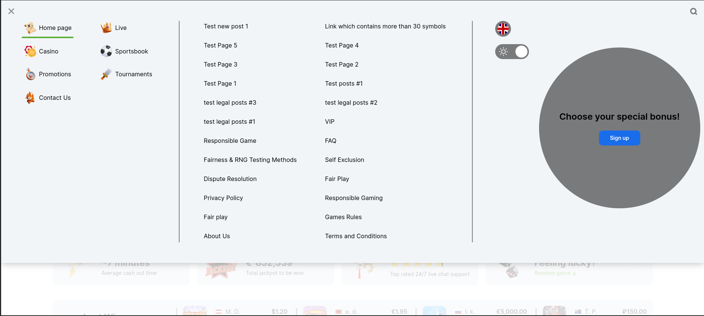
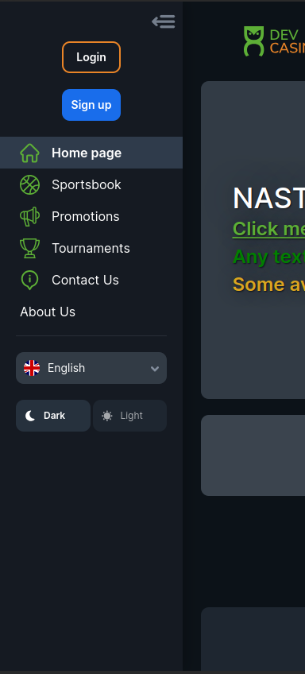
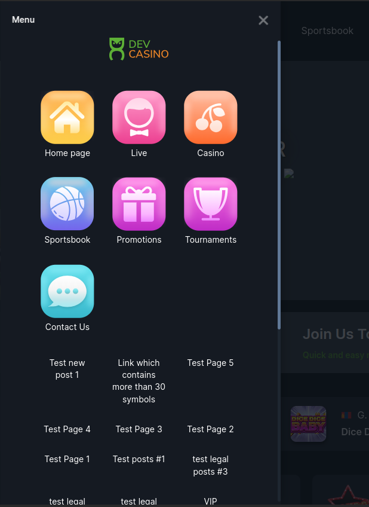
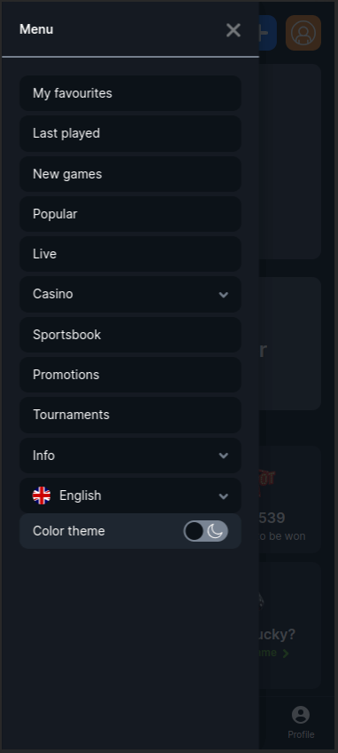
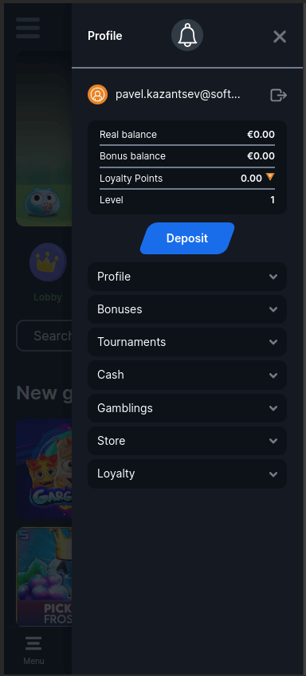

<ul class="nav nav-tabs" role="tablist">
    <li>
        <a href="#english" role="tab" id="english-tab" data-toggle="tab" data-link="english">English</a>
    </li>
        <li class="active">
        <a href="#russian" role="tab" id="russian-tab" data-toggle="tab" data-link="russian">Russian</a>
    </li>
</ul>


### Russian

<div class="tab-content">

<div class="tab-pane fade active" id="c-russian">


# Float-panels Component

Компонент-обертка для `burger-panel`.
Панель имеет два типа отображения:

- выплывающая, содержит бэкдроп и блок с секциями
- раскрывающаяся, не имеет бэкдропа, но имеет фиксированное _раскрытое_/_компактное_ состояние.


## Отображение

SCR1-VAR1 - `'left-def'`



SCR1-VAR2 - `'left-v2'`


SCR2-VAR1 - `'left-def'`



SCR2-VAR2 - `'left-v2'`



MOBILE - `'left-mobile'`



MOBILE - `'right'`




## Входящие параметры

```typescript
export interface IFloatPanelsCParams extends IComponentParams <string, string, string> {
    panels?: IIndexing<IBurgerPanelCParams>;
}

export const defaultParams: IFloatPanelsCParams = {
    moduleName: 'core',
    componentName: 'wlc-float-panels',
    class: 'wlc-float-panels',
    panels: {
        'left-v2': {
            type: 'left',
        },
        'left-def': {
            type: 'left',
            touchEvents: {
                use: false,
            },
        },
        'left-mobile': {
            type: 'left',
        },
        'left-fixed': {
            type: 'left-fixed',
        },
        'right-fixed': {
            type: 'right-fixed',
        },
        right: {
            type: 'right',
            title: gettext('Profile'),
        },
    },
};
```


### English
