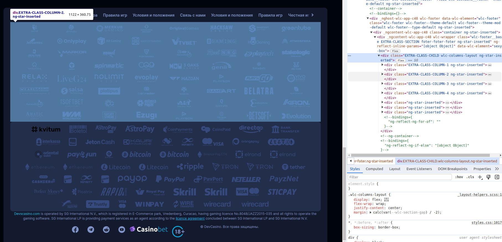
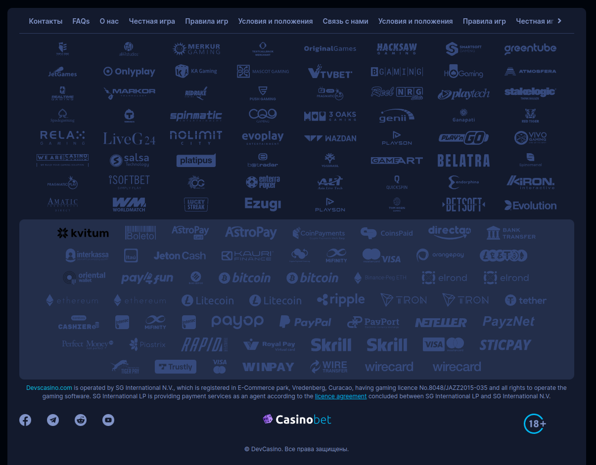

<ul class="nav nav-tabs" role="tablist">
    <li class="active">
        <a href="#russian" role="tab" id="russian-tab" data-toggle="tab" data-link="russian">Russian</a>
    </li>
    <li>
        <a href="#english" role="tab" id="english-tab" data-toggle="tab" data-link="english">English</a>
    </li>
</ul>

<div class="tab-content">
<div class="tab-pane fade active in" id="c-russian">

## Russian
---

</div>
<div class="tab-pane fade" id="c-russian">

# Footer component

#### Footer находится внизу сайта, считается подвалом и представляет собой оболочку для компонентов

##### Подключается в `02.layouts.config.ts` в объекте `$layouts` в ключе `'app'` в секции `footer`. Необходимо в массив компонентов секции передать сам компонент как на примере

```ts
export const $layouts: ILayoutsConfig = {
    'app': {
        replaceConfig: true,
        sections: {
            header: sectionsLib.header.def,
            footer: {
                order: 1000,
                components: [
                    {
                        name: 'core.wlc-footer'
                    }
                ],
            },
        },
    },
}
```
## Параметры

`container` : `true/false` - Включает или отключает контейнер, ограничивающий ширину компонента

---

`config: IWrapperCParams` - Основной параметр для конфигурирования компонентом. Использование на проекте выглядит следующим образом:

```ts
    {
        name: 'core.wlc-footer',
        params: {
            container: true,
            config: {
                class?: string,
                wlcElement?: string,
                components?: ILayoutComponent[],
                smartSection?: ISmartSectionConfig,
            }
        },
    }
```
---

`class` - Добавляет дополнительный класс-модификатор

---

`wlcElement` - data-атрибут служит для авто-тестов. Если не указан явно - то автоматически вставляется имя компонента

---

`components` - Массив компонентов отображаемые в футере. Дефолтный набор компонентов футера прописан в параметрах компонента [footer.params.ts](.//footer.params.ts)

---

`smartSection` - пример применения:
```ts
smartSection: {
    hostClasses: 'EXTRA-CLASS-SECTION', - // Доп.класс для враппера

    innerClasses: 'EXTRA-CLASS-CHILD', - // Доп.оболочка с указанным классом для компонентов (дочерний div для враппера)

    columns: [
        'EXTRA-CLASS-COLUMN-1',
        'EXTRA-CLASS-COLUMN-2',
        'EXTRA-CLASS-COLUMN-3',
        'EXTRA-CLASS-COLUMN-4'] - // Доп.оболочка для каждого компонента в футере (оборачивается в div с прописанными классами). Если прописанных классов меньше, чем используемые компоненты - то для остальных компонентов оболочка div также применяется, только без доп.классов
},
```
`Пример использования smartSection`


---

### Дефолтные параметры:

```ts
export const defaultParams: IFooterCParams = {
    class: 'wlc-footer',
    moduleName: 'core',
    componentName: 'wlc-footer',
    theme: 'default',
    container: true,
    config: {
        components: [
            {
                name: 'core.wlc-wrapper',
                params: {
                    class: 'footer-menu',
                    wlcElement: 'block_footer-info',
                    components: [
                        componentLib.wlcPostMenu.footerInfo,
                    ],
                },
            },
            componentLib.wlcIconList.merchants,
            {
                name: 'icon-list.wlc-icon-payments-list',
                params: {
                    colorIconBg: 'dark',
                    iconsType: 'black',
                    iconComponentParams: {
                        themeMod: 'wolf',
                        watchForScroll: false,
                    },
                },
            },
            {
                name: 'core.wlc-wrapper',
                params: {
                    class: 'footer-disclaimer',
                    id: 1,
                    components: [
                        {
                            name: 'core.wlc-wrapper',
                            params: {
                                class: 'footer-disclaimer__item',
                                components: [
                                    componentLib.wlcDisclaimer.def,
                                ],
                            },
                        },
                    ],
                },
            },
            {
                name: 'core.wlc-wrapper',
                params: {
                    class: 'footer-bottom',
                    id: 1,
                    components: [
                        {
                            name: 'core.wlc-wrapper',
                            params: {
                                class: 'footer-bottom__left',
                                components: [
                                    {
                                        name: 'core.wlc-social-icons',
                                        params: {
                                            theme: 'wolf',
                                            themeMod: 'compact',
                                        },
                                    },
                                ],
                            },
                        },
                        {
                            name: 'core.wlc-wrapper',
                            params: {
                                class: 'footer-bottom__center',
                                components: [
                                    componentLib.wlcLogo.footerWolf,
                                ],
                            },
                        },
                        {
                            name: 'core.wlc-wrapper',
                            params: {
                                class: 'footer-bottom__right',
                                components: [
                                    componentLib.wlcLicense.def,
                                ],
                            },
                        },
                    ],
                },
            },
            componentLib.wlcCopyright.def,
            componentLib.wlcScrollUp.def,
        ],
    },
};
```

### Как выглядит дефолтный футер на сайте

