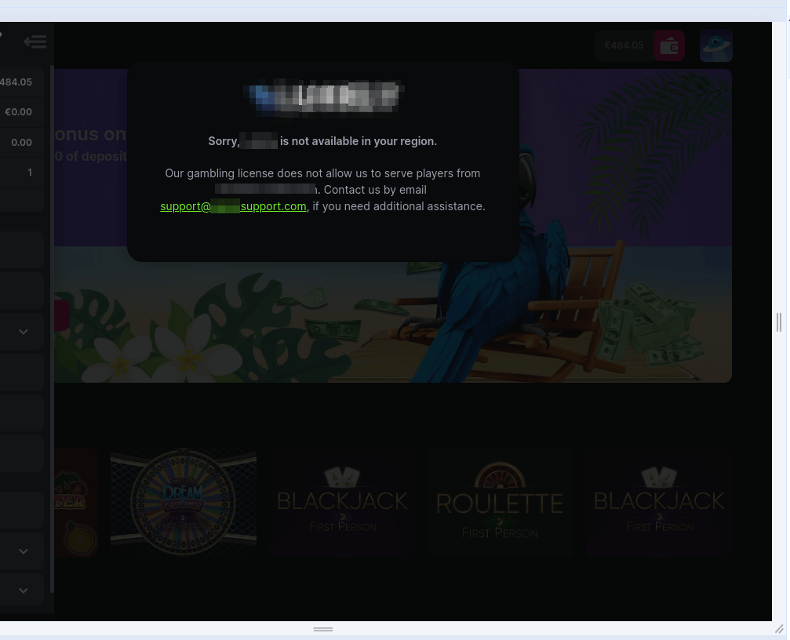
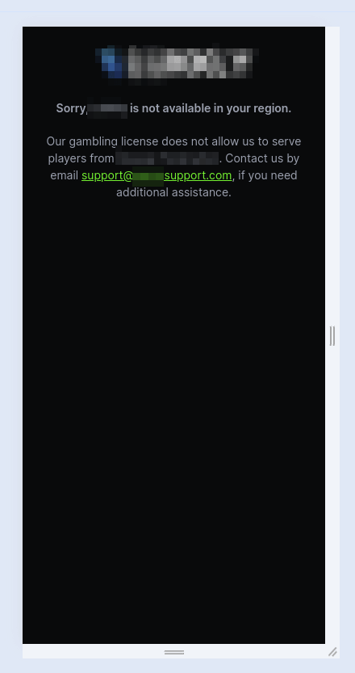
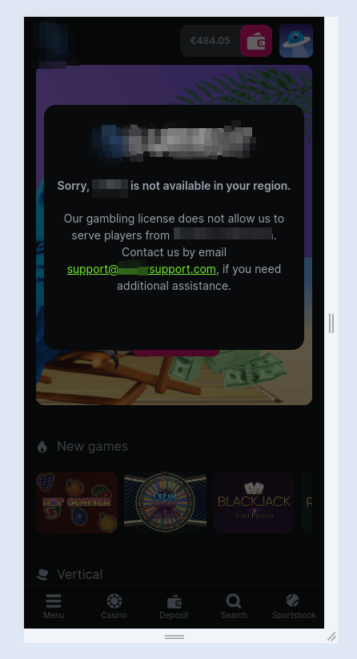

<ul class="nav nav-tabs" role="tablist">
    <li>
        <a href="#english" role="tab" id="english-tab" data-toggle="tab" data-link="english">To English</a>
    </li>
        <li>
        <a href="#russian" role="tab" id="russian-tab" data-toggle="tab" data-link="russian">To Russian</a>
    </li>
</ul>
<div class="tab-content">

<div class="tab-pane fade active" id="c-russian">

## Russian

<font size =5>

# Forbidden-Country Component

    Компонент - модальное окно, оповещающее пользователя о невозможности игры на проекте из страны, находящейся в списке запрещенных.

Блокирует любую возможность взаимодействия пользователя с сайтом.

<font size =5>

## Типы отображения

<font size =3>

- Отображение для Desktop



---

- Отображение для Mobile с конфигом:

```ts
 fullScreenModal: false,
 ```



---

- отображение для Mobile с конфигом:

```ts
 fullScreenModal: true,
 ```



<font size =5>

## Подключение

<font size =3>

```ts
export const $base: IBaseConfig = {

    restrictions: {
        country: {
            use: true,
            fullScreenModal: true,
        },
    },
}
```
- `use` - подключает блокировку проекта при входе в стране из списка запрещенных для игры

- `fullScreenModal` - меняет отображение модального окна при разрешении экрана менее `560px`

На бэке проходит проверка на наличие страны в списке недоступных, ответ приходит в параметре `appConfig.countryRestricted`

Список стран недоступных для игры настраивается в `Fundist`

<font size =5>

## Входящие параметры

<font size =3>

```ts
export const defaultParams: IForbiddenCountryParams = {
    class: 'wlc-forbidden-country',
    casinoName: '',
    countryName: '',
    supportEmail: '',
};
```

- `casinoName` - компонент получает значение из $base.config
- `countryName` - предоставляет backend
- `supportEmail` - компонент получает значение из $base.config

<font size =5>

## English

<font size =5>

# Forbidden-Country Component

    Component - A modal window, notifying user that it is impossible to play in a project in country from "Black List"

Blocks any possibility of user interaction with the product.

<font size =5>

## View Type

- Desktop View


---

- Mobile View with configuration:

```ts
 fullScreenModal: false,
 ```


---

- Mobile View with configuration:

```ts
 fullScreenModal: true,
 ```


<font size =5>

## Connection

<font size =3>

```ts
export const $base: IBaseConfig = {

    restrictions: {
        country: {
            use: true,
            fullScreenModal: true,
        },
    },
}
```

- `use` - enables project blocking when entering from a country in the list of prohibited

- `fullScreenModal` - changes the view of the modal window at a screen resolution less than `560px`

Presence of the country in the list of restricted items is checked by backend.

The list of countries not available for the game is configured in the `Fundist`

<font size =5>

## Incoming params

<font size =3>

```ts
export const defaultParams: IForbiddenCountryParams = {
    class: 'wlc-forbidden-country',
    casinoName: '',
    countryName: '',
    supportEmail: '',
};
```

- `casinoName` - the component gets the value from $base.config
- `supportEmail` - the component gets the value from $base.config
- `countryName` - this is provided by the backend
