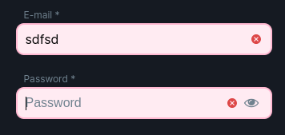

<ul class="nav nav-tabs" role="tablist">
    <li class="active">
        <a href="#english" role="tab" id="english-tab" data-toggle="tab" data-link="english">English</a>
    </li>
    <li>
        <a href="#russian" role="tab" id="russian-tab" data-toggle="tab" data-link="russian">Russian</a>
    </li>
</ul>
<div class="tab-content">
<div class="tab-pane fade active in" id="c-english">

## English

# form-control Component

A part of the form validator functionality. Depending on the correct input value, shows valid/invalid icons


### Description of the component

Component has a few @Input decorators

```ts
export class FormControlComponent implements OnInit, OnDestroy {
    @Input() control: UntypedFormControl;
    @Input() className: string;
    @Input() fieldName: string;
    @Input() validators: ValidatorType[];

    ...
}
```

* `@Input() control` - implements any checks for valid input

* `@Input() className` - depends on valid state, pass class name

* `@Input() fieldName` - pass field name

* `@Input() validators` - validator

---

Component has a public method isValueEmpty, and check if input value is an empty

```ts
    public get isValueEmpty(): boolean {
        return !_toString(this.control.value).length;
    }
```
---

**Styles**

Valid input


---

Invalid input



</div>
<div class="tab-pane fade" id="c-russian">

---
## Russian
# form-control Component
Часть функционала валидатора для форм. В зависимости от корректного ввода данных в инпут, показывает иконку валидности/невалидности


### Описание компонента

Компонент имеет несколько @Input декораторов

```ts
export class FormControlComponent implements OnInit, OnDestroy {
    @Input() control: UntypedFormControl;
    @Input() className: string;
    @Input() fieldName: string;
    @Input() validators: ValidatorType[];

    ...
}
```

* `@Input() control` - реализует различные проверки инпута на валидность

* `@Input() className` - передаёт название класса в зависимости от валидности

* `@Input() fieldName` - передаёт имя поля

* `@Input() validators` - валидатор

---

У компонента есть публичный метод isValueEmpty, который определяет, является ли значение инпута пустым.

```ts
    public get isValueEmpty(): boolean {
        return !_toString(this.control.value).length;
    }
```
---

**Применённые стили**

валидные данные


---

невалидные данные


---


</div>
</div>
