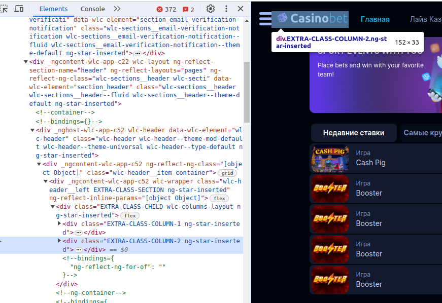
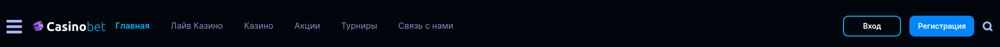

ul class="nav nav-tabs" role="tablist">
    <li class="active">
        <a href="#russian" role="tab" id="russian-tab" data-toggle="tab" data-link="russian">Russian</a>
    </li>
    <li>
        <a href="#english" role="tab" id="english-tab" data-toggle="tab" data-link="english">English</a>
    </li>
</ul>

<div class="tab-content">
<div class="tab-pane fade active in" id="c-russian">

## Russian
---

</div>
<div class="tab-pane fade" id="c-russian">

# Header component

##### Подключается в `02.layouts.config.ts` в объекте `$layouts` в ключе `'app'` в секции `header`. Необходимо в массив компонентов секции передать сам компонент как на примере

```ts
export const $layouts: ILayoutsConfig = {
    'app': {
        replaceConfig: true,
        sections: {
            header: {
                components: [
                    {
                        name: 'core.wlc-header',
                    }
                ],
            },
            footer: {
                order: 1000,
                components: [
                    {
                        name: 'core.wlc-footer'
                    }
                ],
            },
        },
    },
}
```
## Параметры
```ts
    {
        name: 'core.wlc-header',
        params: {
            container?: boolean,
            config?: IHeaderConfig
        },
    }
```

`container` : `true/false` - Добавляет дополнительный класс `container` к оболочке компонентов, ограничивающий ширину хэдэра, НО не добавляет дополнительную оболочку

`config`- включает в себя дополнительные поля конфигурации. Хэдэр разделяется на три части. Каждую из которых можно конфигурировать индивидуально
```ts
config: {
    left: IWrapperCParams, // Левая часть хэдэра
    base: IWrapperCParams,  // Центральная часть хэдэра
    right: IWrapperCParams, // Правая часть хэдэра
}
```

Используя интерфейс `IWrapperCParams` параметр `config` в развернутом виде будет выглядеть так:

```ts
config: {
    left: {
        class?: string,
        wlcElement?: string,
        components?: ILayoutComponent[],
        smartSection?: ISmartSectionConfig,
    },
    base: {
        class?: string,
        wlcElement?: string,
        components?: ILayoutComponent[],
        smartSection?: ISmartSectionConfig,
    },
    right: {
        class?: string,
        wlcElement?: string,
        components?: ILayoutComponent[],
        smartSection?: ISmartSectionConfig,
    },
}
```
#### Подробнее про параметры `IWrapperCParams`

`class` - Добавляет дополнительный класс-модификатор

---

`wlcElement` - data-атрибут служит для авто-тестов. Если не указан явно - то автоматически вставляется имя компонента

---

`components` - Массив компонентов отображаемые в определенной части хэдэра. Дефолтный набор компонентов хэдэра прописан в параметрах компонента [header.params.ts](.//header.params.ts)

---

`smartSection` - пример применения:
```ts
smartSection: {
    hostClasses: 'EXTRA-CLASS-SECTION', - // Доп.класс для враппера

    innerClasses: 'EXTRA-CLASS-CHILD', - // Доп.оболочка с указанным классом для компонентов (дочерний div для враппера)

    columns: [
        'EXTRA-CLASS-COLUMN-1',
        'EXTRA-CLASS-COLUMN-2',
        'EXTRA-CLASS-COLUMN-3',
        'EXTRA-CLASS-COLUMN-4'] - // Доп.оболочка для каждого компонента в хэдэре (оборачивается в div с прописанными классами). Если прописанных классов меньше, чем используемые компоненты - то для остальных компонентов оболочка div также применяется, только без доп.классов
},
```

`Пример использования smartSection`



---

#### Дефолтные настройки хэдэра выглядят следующим образом (на январь 2024 имеется только тема "universal")

```ts
export const defaultParams: IHeaderCParams = {
    class: 'wlc-header',
    moduleName: 'core',
    componentName: 'wlc-header',
    theme: 'universal',
    container: true,
    config: {
        left: {
            components: [
                componentLib.wlcButton.burger,
                componentLib.wlcLogo.header,
            ],
        },
        base: {
            components: [
                componentLib.wlcMainMenu.header,
            ],
        },
        right: {
            components: [
                componentLib.wlcLoginSignup.header,
                componentLib.wlcUserInfo.header,
                componentLib.wlcButton.userDepositIcon,
                componentLib.wlcButton.searchV2,
                componentLib.wlcButton.signup,
            ],
        },
    },
};
```

### Дефолтный вид хэдэра


