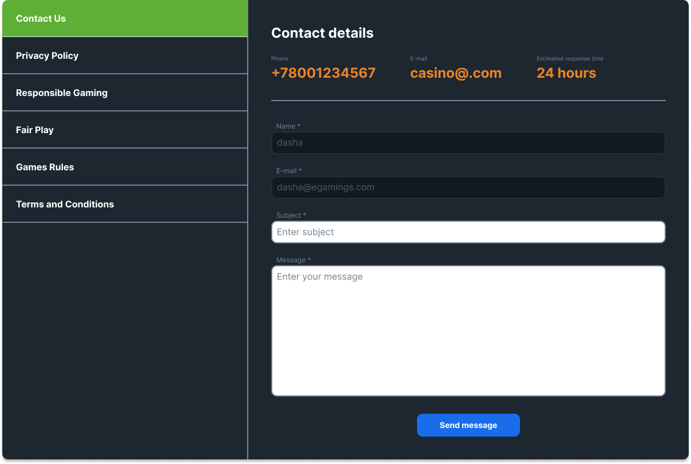
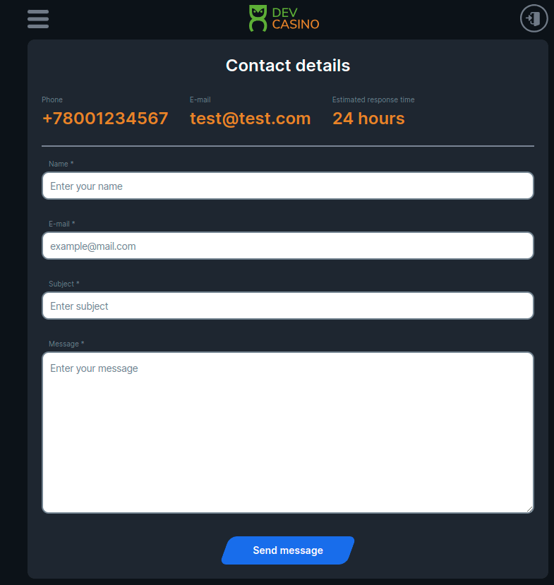
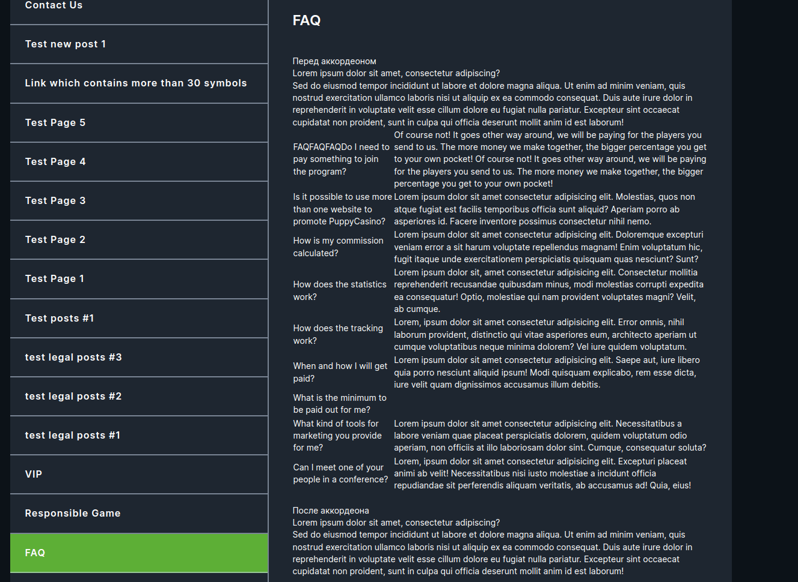
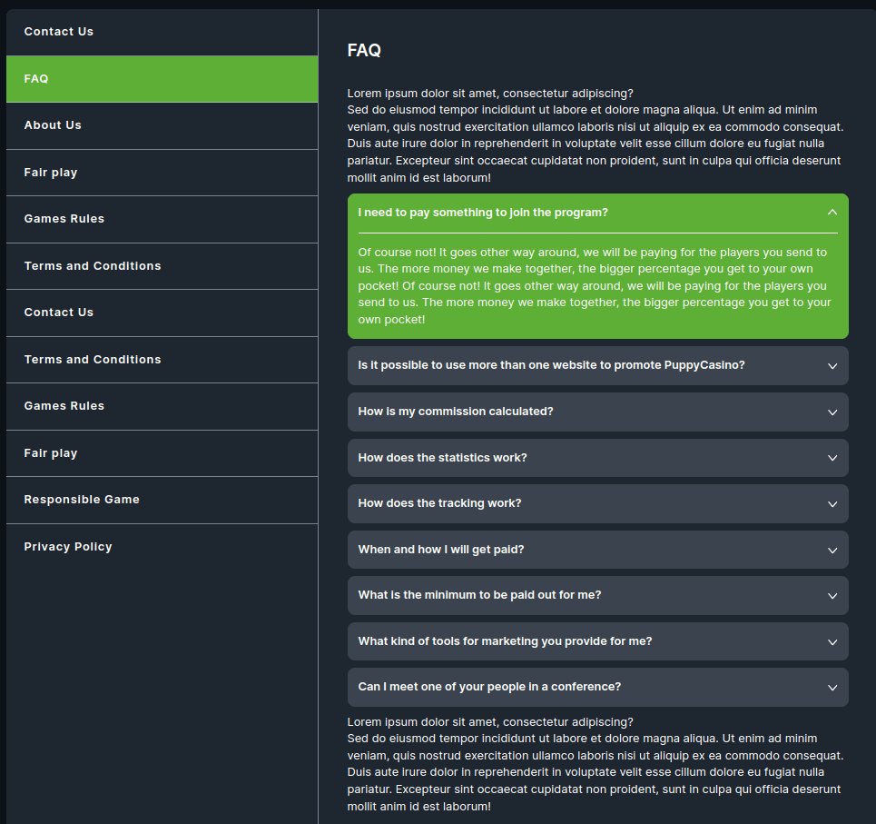
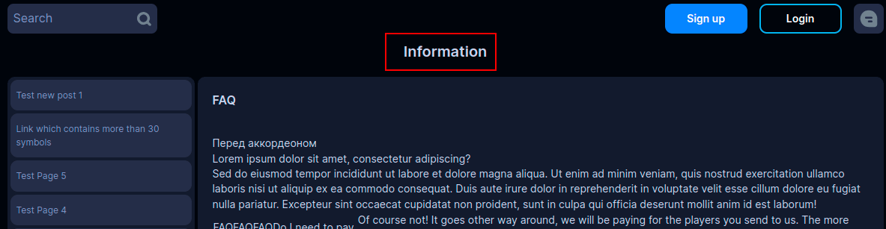

<ul class="nav nav-tabs" role="tablist">
    <li>
        <a href="#english" role="tab" id="english-tab" data-toggle="tab" data-link="english">English</a>
    </li>
        <li class="active">
        <a href="#russian" role="tab" id="russian-tab" data-toggle="tab" data-link="russian">Russian</a>
    </li>
</ul>

### Russian

<div class="tab-content">

<div class="tab-pane fade active" id="c-russian">

# Info-page Component

Состоит из двух частей. В первой(слева) отображается список страниц, получаемых извне(WordPress). Во второй(справа) отображается содержимое выбранной страницы.

Для мобильных устройств отображается один блок с контентом без блока меню.

## Отображение

    Для всех профилей имеет 'default' состояние для ComponentTheme / ComponentType / ModeType

- **Desktop**



- **Mobile**



## Входящие параметры

```typescript
export interface IInfoPageCParams extends IComponentParams<ComponentTheme, ComponentType, string> {
    config?: IInfoPageConfig;
    useFaqAccordion?: boolean;
    customConfig?: IIndexing<ILayoutComponent[]>;
}

export const defaultParams: IInfoPageCParams = {
    class: 'wlc-info-page',
    moduleName: 'core',
    componentName: 'wlc-info-page',
    useFaqAccordion: false,
};
```

- `useFaqAccordion` - переключает отображение страницы FAQ между двумя состояниями:

```ts
Дефолтное состояние:   'useFaqAccordion': false
```



___

```ts
Список с раскрывающимися элементами: 'useFaqAccordion': true
```



- `title` - применяется в теме Wolf. Задаёт  заголовок для компонента *Info-page*



### English
