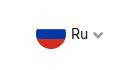
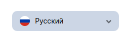
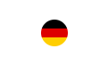

<ul class="nav nav-tabs" role="tablist">
    <li class="active">
        <a href="#english" role="tab" id="english-tab" data-toggle="tab" data-link="english">English</a>
    </li>
    <li>
        <a href="#russian" role="tab" id="russian-tab" data-toggle="tab" data-link="russian">Russian</a>
    </li>
</ul>
<div class="tab-content">
<div class="tab-pane fade active in" id="c-english">

## English

# Language-selector Component
Selector for language with dropdown or modal window.

 **Default view**



## Params

- **themeMod**: `'bottom-left' | 'bottom-right' | 'top-left' | 'top-right' | 'long'`  - sets the location of the dropdown list relative to the language selector; the 'long' value changes the view of the selector to horizontal
- **type**: `'click' | 'hover' | 'compact'` - specifies how the dropdown list is opened; the 'compact' value reflects all languages at once
- **common**:
    * **flags**:
        - **path**: `'string'` - path to folder with flag icons
        - **dim**: `'string'` - flag icon format
        - **replace** - in case of mismatch between the name of the language and the country flag, it can be specified through the key the necessary picture to display
            * **key:string**: `'string'` - example: `en: 'gb'`
- **currentLang**:
    * **hideFlag**: `'boolean'` - removes the country flag from the selector
    * **hideLang**: `'boolean'` - removes the short name of the selector language
    * **hideArrow**: `'boolean'` - removes the arrow next to the selector
- **dropdown**:
    * **hideFlag**: `'boolean'` - removes the country flag from the dropdown list
    * **hideLang**: `'boolean'` - removes the short name of the selector language from the dropdown list
    * **expandableOnHover**: `'boolean'` - when 'true' is specified, allows you to open the dropdown list on hover
- **itemLangHeight**: `'number'` - sets the height of one language selection item (it is necessary to calculate the size of the dropdown window and open it to the side where there is free space for it)
- **countLangFromDropdown**: `'number'` - the number up to which languages will be opened in the dropdown list (if the number of languages exceeds the specified number, language icons will be opened in a modal window)
- **toggleOnScroll**: `'bottom-left' | 'bottom-right' | 'top-left' | 'top-right' | 'long'` - sets dynamic changes to the dropdown list, opening it depending on the distance to the bottom/top of the screen; if this parameter is not set, the dropdown list will open at the position specified in the **themeMod** parameter, even if its size is larger than the screen space
- **order**: `'string'` - specifies a certain order for displaying languages using an array of keys, example: `['ru', 'en', 'pt-br']`
- **compactMod**: `'boolean'` - applies only with fixed panel and with themeMod: 'long', allows to display the selector in compact form when the fixed panel is closed
- **fixedPanelPosition**: `'left' | 'right'` - applies only with fixed panel, for correct switching of selector states from 'compact' to 'long'; the value must correspond to the location of the fixed panel
- **useTooltip**: `'boolean'` - If 'true', a tooltip with the full name of the language is displayed
- **defaultIcon**: `'string'` - used on the *scr3-wolf1* branch, default picture in the closed selector (instead of the country flag of the selected language)
- **wlcElement**: `'string'` - adds the specified attribute 'data-wlc-element', with a unique value, for autotests
---
### Default params

```ts
export const defaultParams: ILanguageSelectorCParams = {
    componentName: 'wlc-language-selector',
    moduleName: 'core',
    class: 'wlc-language-selector',
    themeMod: 'bottom-left',
    type: 'click',
    common: {
        flags: {
            path: '/wlc/flags/1x1/',
            dim: 'svg',
            replace: {
                en: 'gb',
                zh: 'cn',
                'zh-hans': 'cn',
                'zh-hant': 'cn',
                'sp': 'es',
                'da': 'dk',
                'sv': 'se',
            },
        },
    },
    itemLangHeight: 40,
    countLangFromDropdown: 6,
    wlcElement: 'block_language-selector',
    compactMod: false,
    useTooltip: false,
    fixedPanelPosition: 'left',
};
```
### Using component

```ts
componentName: 'wlc-language-selector',
moduleName: 'core',
class: 'wlc-language-selector',
themeMod: 'bottom-left',
type: 'hover',
common: {
    flags: {
        path: '/wlc/flags/1x1/',
        dim: 'svg',
        replace: {
            en: 'gb',
            zh: 'cn',
            'zh-hans': 'cn',
            'zh-hant': 'cn',
            'sp': 'es',
            'da': 'dk',
            'sv': 'se',
        },
    },
},
currentLang: {
    hideLang: true,
    hideArrow: true,
},
itemLangHeight: 40,
countLangFromDropdown: 15,
wlcElement: 'block_language-selector',
compactMod: false,
useTooltip: false,
fixedPanelPosition: 'left',
```

</div>
<div class="tab-pane fade" id="c-russian">

---
## Russian
# Language-selector Component
Селектор языка с выпадающим списком или модальным окном.

## Параметры

- **themeMod**: `'bottom-left' | 'bottom-right' | 'top-left' | 'top-right' | 'long'`  - задаёт расположение выпадающего списка относительно селектора языка; значение 'long' меняет вид селектора в горизонтальный
- **type**: `'click' | 'hover' | 'compact'` - задаёт способ открытия выпадающего списка; значение 'compact' отражает все языки сразу
- **common**:
    * **flags**:
        - **path**: `'string'` - путь до каталога, с иконками флагов
        - **dim**: `'string'` - формат иконок флагов
        - **replace** - при несоответствии названия языка и флага страны, можно переназначить через ключ нужную картинку для отображения
            * **key:string**: `'string'` - пример: `en: 'gb'`
- **currentLang**:
    * **hideFlag**: `'boolean'` - убирает флаг страны у селектора
    * **hideLang**: `'boolean'` - убирает краткое текстовое обозначение языка селектора
    * **hideArrow**: `'boolean'` - убирает стрелку рядом с селектором
- **dropdown**:
    * **hideFlag**: `'boolean'` - убирает флаг в выпадающем списке
    * **hideLang**: `'boolean'` - убирает краткое текстовое обозначение языка в выпадающем списке
    * **expandableOnHover**: `'boolean'` - значение 'true', позволяет открывать выпадающий список при наведении на селектор
- **itemLangHeight**: `'number'` - задаёт высоту одного элемента выбора языка (нужно для того, чтоб высчитать размер выпадающего окна и открыть его в ту сторону, где есть свободное место для него)
- **countLangFromDropdown**: `'number'` - число, до которого языки будут открываться в выпадающем списке (если количество языков превышает указанное, иконки языков открываются в модальном окне)
- **toggleOnScroll**: `'bottom-left' | 'bottom-right' | 'top-left' | 'top-right' | 'long'` - задаёт динамические изменения выпадающему списку, открывая его в зависимости от расстояния до низа/верха экрана; если этот параметр не задан, то выпадающий список будет открываться в положение указанном в параметре **themeMod**, даже если его размеры больше, чем места на экране
- **order**: `'string'` - задаёт определенный порядок для отображения языков с помощью массива со строковыми значениями кодов языков, пример: `['ru', 'en', 'pt-br']`
- **compactMod**: `'boolean'` - применяется только при фиксированной панели и при themeMod: 'long', позволяет отображать селектор в компактом виде при закрытой фиксированной панели
- **fixedPanelPosition**: `'left' | 'right'` - применяется только при фиксированной панели, для корректного переключения состояний селектора из 'compact' в 'long'; значение должно соответствовать расположению фиксированной панели
- **useTooltip**: `'boolean'` - при значении 'true' отображается подсказка с полным названием языка
- **defaultIcon**: `'string'` - используется на ветке *scr3-wolf1*, дефолтная картинка в закрытом селекторе (вместо флага страны выбранного языка)
- **wlcElement**: `'string'` - добавляет указанный атрибут 'data-wlc-element', с уникальным значением, для автотестирования
---
### Дефолтные параметры
```ts
export const defaultParams: ILanguageSelectorCParams = {
    componentName: 'wlc-language-selector',
    moduleName: 'core',
    class: 'wlc-language-selector',
    themeMod: 'bottom-left',
    type: 'click',
    common: {
        flags: {
            path: '/wlc/flags/1x1/',
            dim: 'svg',
            replace: {
                en: 'gb',
                zh: 'cn',
                'zh-hans': 'cn',
                'zh-hant': 'cn',
                'sp': 'es',
                'da': 'dk',
                'sv': 'se',
            },
        },
    },
    itemLangHeight: 40,
    countLangFromDropdown: 6,
    wlcElement: 'block_language-selector',
    compactMod: false,
    useTooltip: false,
    fixedPanelPosition: 'left',
};
```
### Использование компонента

```ts
componentName: 'wlc-language-selector',
moduleName: 'core',
class: 'wlc-language-selector',
themeMod: 'bottom-left',
type: 'hover',
common: {
    flags: {
        path: '/wlc/flags/1x1/',
        dim: 'svg',
        replace: {
            en: 'gb',
            zh: 'cn',
            'zh-hans': 'cn',
            'zh-hant': 'cn',
            'sp': 'es',
            'da': 'dk',
            'sv': 'se',
        },
    },
},
currentLang: {
    hideLang: true,
    hideArrow: true,
},
itemLangHeight: 40,
countLangFromDropdown: 15,
wlcElement: 'block_language-selector',
compactMod: false,
useTooltip: false,
fixedPanelPosition: 'left',
```
---
Использование компонента:
```ts
themeMod: 'long'
```


---

```ts
currentLang: {
    hideLang: true,
    hideArrow: true,
}
```


</div>
</div>
