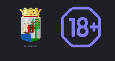
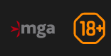
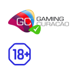
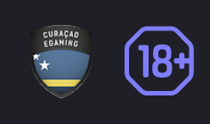
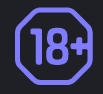

<ul class="nav nav-tabs" role="tablist">
    <li  class="active">
        <a href="#russian" role="tab" id="russian-tab" data-toggle="tab" data-link="russian">Russian</a>
    </li>
    <li>
        <a href="#english" role="tab" id="english-tab" data-toggle="tab" data-link="english">English</a>
    </li>
</ul>
<div class="tab-content">
<div class="tab-pane fade active in" id="c-russian">

## Russian

</div>
<div class="tab-pane fade" id="c-russian">

# License component

Компонент отображает имеющуюся у проекта лицензию на игорную деятельность.</br>
В зависимости от указанных параметров в конфиге проекта ```config/frontend/04.modules.config.ts``` отображает одну из следующих возможных лицензий:
## 1. Antillephone (ApgSeal)
Применяется на большинстве проектов.


<br/><br/>

### Пример конфига

```typescript
export const $modules = {
    core: {
        components: {
            'wlc-license': {
                apgSeal: {
                    sealId: 'c162bcbe-b984-46fc-b701-f90ddf27c151',
                    sealDomain: 'www.devcasino.com',
                },
            },
        },
    },
}
```

## 2. Malta Gaming Authority (MGA)
<br/><br/>

<br/><br/>
### Пример конфига
```typescript
export const $modules = {
    core: {
        components: {
            'wlc-license': {
                mga: {
                    companyId: '3b210c49-75b4-4899-9e4d-fb9c5b304be1',
                },
            },
        },
    },
};
```


## 3. Curacao gambling license
### Вариант 1
 C указанием кода лицензии или URL проверки лицензии (параметры ```code``` и ```url``` соответственно) - данный вариант используется для проектов, где лицензия Curasao получена
<br/><br/>

<br/><br/>
#### Пример конфига
```typescript
export const $modules = {
    core: {
        components: {
            'wlc-license': {
                curacao: {
                    url: 'https://licensing.gaming-curacao.com/validator/?lh=8d48638ca3ef69605cee0b06b7829b21&template=tseal',
                },
            },
        },
    },
},
```


### Вариант 2
С указанием в параметре ```icon``` кастомного изображения лицензии Curacao и ссылки на pdf-сертификат (необязательный параметр ```pdf```) - данный вариант является временным решением для проекта, пока он находится в стадии получения рабочей лицензии Curacao с верификацией.


<br/><br/>

<br/><br/>

Здесь можно указать файл изображения лицензии, хранящийся локально в проекте, либо  передать строковое значение гиперссылки на внешний ресурс в параметр ```icon```, например:
```typescript
icon: 'static/images/custom_license_image.png' // ссылка на локальный файл
// или
icon: 'https://verification.curacao-egaming.com/validate.ashx?domain=devcasino.com', // гиперссылка на внешний ресурс
```

Если переданное в параметр значение не является строковым, будет вставлено дефолтное изображение лицензии из файла **gstatic/wlc/icons/curacao-egaming-logo.png**:
<br/><br/>


<br/><br/>
Для добавления к изображению гиперссылки на файл сертификата лицензии , необходимо указать путь к файлу сертификата в параметре ```pdf```(поддерживаются ссылки на локальные файлы проекта, а также на внешние ресурсы):
```typescript
pdf: 'static/images/license_certificate.pdf', // ссылка на локальный файл в проекте
// или
pdf: 'https://verification.curacao-egaming.com/validateview.aspx?domain=devcasino.com', // ссылка на внешний ресурс
```
Если в параметр ```pdf``` передать любое значение, отличающееся от строкового, будет вставлена ссылка на локальный файл ***'/static/curacao_license.pdf'***

### Пример конфига

```typescript
export const $modules = {
    core: {
        components: {
            'wlc-license': {
                curacao: {
                    icon: 'https://verification.curacao-egaming.com/validate.ashx?domain=devcasino.com',
                    pdf: true,
                },
            },
        },
    },
},
```
<br/><br/><br/>
### Во всех типах лицензии дополнительно отображается иконка "18+":
<br/>


---


## English

</div>
<div class="tab-pane fade" id="c-english">


</div>
</div>

</div>
</div>
