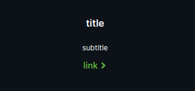
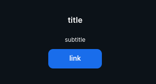
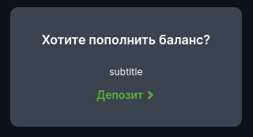

<ul class="nav nav-tabs" role="tablist">
    <li class="active">
        <a href="#english" role="tab" id="english-tab" data-toggle="tab" data-link="english">English</a>
    </li>
    <li>
        <a href="#russian" role="tab" id="russian-tab" data-toggle="tab" data-link="russian">Russian</a>
    </li>
</ul>
<div class="tab-content">
<div class="tab-pane fade active in" id="c-english">

# English

# Link-block Component
A link leading to a page, modal window, or firing an event.

## View

 **Default view**


---

```ts
useLinkButton: false
```



---

```ts
useInteractiveText: true,
themeMod: 'secondary'
```


## Params

- **themeMod**: `'default' | 'secondary' | 'custom'` - link style
* **common**
    - **title**: `string` - title before the link
    - **subtitle**: `string` - text, between title and link, that contains information about link way
    - **link**: `string` - link text
    - **actionParams**: `modal | url | event | callback`
        * **Modal** - using the key, assigns a specific Modal window that will pop up when click on the specified icon (all existing Modal windows can be viewed in the file modal.params.ts const MODALS_LIST);
        * **Url** - contains link to internal pages of the site;
        * **Event** - contains event assigned via the key;
        * **Callback** - custom function
    - **useInteractiveText**: ` true | false` - when "true" it sets the link text and title to change dynamically
    - **useLinkButton**: ` true | false` - link looks like a button

---
### Default params

```typescript
export const defaultParams: ILinkBlockCParams = {
    moduleName: 'core',
    componentName: 'wlc-link-block',
    class: 'wlc-link-block',
    common: {
        actionParams: {},
        useInteractiveText: false,
        useLinkButton: true,
    },
};
```
### Using component

```ts
 {
    name: 'core.wlc-link-block',
    params: {
        themeMod: 'default',
        common: {
            link: 'link',
            title: 'title',
            subtitle: 'subtitle',
            actionParams: {
                url: {
                    path: 'app.profile.cash.deposit',
                },
            },
            useInteractiveText: false,
            useLinkButton: true,
        }
    },
},
```

</div>
<div class="tab-pane fade" id="c-russian">

# Russian

# Link-block Component
Ссылка, ведущая на страницу, модальное окно или генерирующая событие.

## Параметры

- **themeMod**: `'default' | 'secondary'` - стиль ссылки, также может создаваться кастомный стиль
* **common**
    - **title**: `string` - заголовок перед ссылкой
    - **subtitle**: `string` - текст между заголовком и ссылкой, предисловие о том, куда ведёт ссылка
    - **link**: `string` - текст самой кнопки
    - **actionParams**: `modal | url | event | callback`
        * **Modal** - с помощью ключа задает идентификатор модального окна, которое будет отображено при нажатии на указанную ссылку (все существующие Modal окна можно посмотреть в файле [modal.params.ts](/src/modules/core/components/modal/modal.params.ts) содержатся в const MODALS_LIST);
        * **Url** - содержит ссылку на внутренние страницы сайта;
        * **Event** - содержит событие, которое присваивается с помощью ключа;
        * **Callback** - кастомная функция
    - **useInteractiveText**: ` true | false` - при true устанавливает динамическое изменение текста ссылки и заголовка
    - **useLinkButton**: ` true | false` - при false меняет отображение ссылки в вид кнопки

---
### Дефолтные параметры
```typescript
export const defaultParams: ILinkBlockCParams = {
    moduleName: 'core',
    componentName: 'wlc-link-block',
    class: 'wlc-link-block',
    common: {
        actionParams: {},
        useInteractiveText: false,
        useLinkButton: true,
    },
};
```
### Использование компонента

```ts
 {
    name: 'core.wlc-link-block',
    params: {
        themeMod: 'default',
        common: {
            link: 'link',
            title: 'title',
            subtitle: 'subtitle',
            actionParams: {
                url: {
                    path: 'app.profile.cash.deposit',
                },
            },
            useInteractiveText: false,
            useLinkButton: true,
        }
    },
},
```
</div>
</div>
