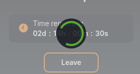

<ul class="nav nav-tabs" role="tablist">
    <li>
        <a href="#english" role="tab" id="english-tab" data-toggle="tab" data-link="english">To English</a>
    </li>
    <li>
        <a href="#russian" role="tab" id="russian-tab" data-toggle="tab" data-link="russian">To Russian</a>
    </li>
</ul>
<div class="tab-content">

<div class="tab-pane fade active" id="c-russian">

## Russian

# Loader Component

    Компонент-заглушка, который отображается вместо контента в компоненте, либо вместо всего компонента, в промежутке времени между созданием компонента(который заменяется лоадером) и до получения им данных.

## Типы отображения

<table>
   <thead>
        <tr>
            <th>1. type "ring"</th>
            <th>2. type "logo"</th>
            <th>2. type "ring-with-logo"</th>
            <th>2. type "with-overlay"</th>
        </tr>
    </thead>
    <tbody>
        <tr>
            <td style="padding-right:40px;">
                
            </td>
            <td>
                
            </td>
            <td>
                
            </td>
            <td>
                
            </td>
        </tr>
    </tbody>
</table>


## Входящие параметры

```ts
export const defaultParams: ILoaderCParams = {
    moduleName: 'core',
    componentName: 'wlc-loader',
    class: 'wlc-loader',
    type: 'ring',
    common: {
        logoPath: 'logo.svg',
    },
};
```

`logoPath` - задаёт путь до иконки для лоадера с типом *`logo`* , *`ring-with-logo`*

## English

# Loader Component

    A stub component which displayed, during the time starting from creation of the component (which is replaced by the loader) and before it receives data.

## View Type

<table>
   <thead>
        <tr>
            <th>1. type "ring"</th>
            <th>2. type "logo"</th>
            <th>2. type "ring-with-logo"</th>
            <th>2. type "with-overlay"</th>
        </tr>
    </thead>
    <tbody>
        <tr>
            <td style="padding-right:40px;">
                
            </td>
            <td>
                
            </td>
            <td>
                
            </td>
            <td>
                
            </td>
        </tr>
    </tbody>
</table>


## Incoming Parameters
```ts
export const defaultParams: ILoaderCParams = {
    moduleName: 'core',
    componentName: 'wlc-loader',
    class: 'wlc-loader',
    type: 'ring',
    common: {
        logoPath: 'logo.svg',
    },
};
```

`logoPath` - sets the path to the icon for the loader with the type *`logo`* , *`ring-with-logo`*
