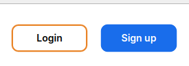
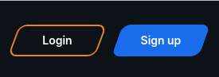
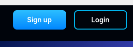
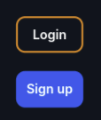

<ul class="nav nav-tabs" role="tablist">
    <li class="active">
        <a href="#english" role="tab" id="english-tab" data-toggle="tab" data-link="english">English</a>
    </li>
    <li>
        <a href="#russian" role="tab" id="russian-tab" data-toggle="tab" data-link="russian">Russian</a>
    </li>
</ul>
<div class="tab-content">
<div class="tab-pane fade active in" id="c-english">

### Russian

# Login-signup Component

Компонент содержит две кнопки - кнопку `Login` и кнопку `Sign up`

Кнопка `Sign up` открывает модальное окно регистрации пользователя на сайте

Кнопка `Login` открывает модальное окно входа на сайт.

Также, при клике на кнопку, компонент проверяет тип сайта (основной сайт либо аффилейтка)
и в случае с аффилейткой происходит редирект на портал бэк-офиса аффилейтки(находится на другом поддомене), где и происходит логин/регистрация.

У самого сайта(лэндинга) аффилейтки нет функционала логина/регистрации.

## Варианты Отображения

<table>
   <thead>
        <tr>
            <th>theme-default (scr1-var1)</th>
            <th>theme-default (scr1-var2)</th>
            <th>theme-wolf (scr3-wolf1)</th>
            <th>theme-default (vertical)</th>
        </tr>
    </thead>
    <tbody>
        <tr>
            <td style="padding-right:40px;">
                
            </td>
            <td style="padding-right:40px;">
                
            </td>
            <td style="padding-right:40px;">
                
            </td>
             <td style="padding-right:40px;">
                
            </td>
        </tr>
    </tbody>
</table>

## Входящие параметры

```ts
export type IButtonCParams = {
    action?: IActionType;  // Определяет какое модальное окно будет открыто при клике на кнопку
    title?: string; // Задает текст отображаемый на кнопке
    url?: string; // Если задан - перенаправляет по заданному пути при клике на кнопку
    target?: ITargetType; // Определяет откроется ли модальное окно в текущей вкладке или в новой вкладке
    animate?: TButtonAnimation; // Задает тип анимации кнопки
};

export interface ILoginSignupCParams extends IComponentParams<ComponentTheme, ComponentType, ComponentThemeMod> {
    login?: IButtonCParams;           //**
    signup?: IButtonCParams;          //*  настройка кнопок компонента
    changePassword?: IButtonCParams;  //**
}

export const defaultParams: ILoginSignupCParams = {
    class: 'wlc-login-signup',
    moduleName: 'user',
    componentName: 'wlc-login-signup',
    changePassword: {
        action: 'changePassword',
    },
};
```

### English

# Login-signup Component

The Component includ two buttons - `Login` button and `Sign up` button

The `Sign up` button opens Registration modal window

The `Login` button opens Login modal window


Also, when clicking on the button, the component checks the type of site (main site or affiliate)
and in the case of an affiliate, a redirect occurs to the portal of the affiliate's back office (located on another subdomain), where login / registration takes place.

The affiliate's website itself does not have login/registration functionality.

## View

<table>
   <thead>
        <tr>
            <th>theme-default (scr1-var1)</th>
            <th>theme-default (scr1-var2)</th>
            <th>theme-wolf (scr3-wolf1)</th>
            <th>theme-default (vertical)</th>
        </tr>
    </thead>
    <tbody>
        <tr>
            <td style="padding-right:40px;">
                
            </td>
            <td style="padding-right:40px;">
                
            </td>
            <td style="padding-right:40px;">
                
            </td>
             <td style="padding-right:40px;">
                
            </td>
        </tr>
    </tbody>
</table>

## Incoming params

```ts
export type IButtonCParams = {
    action?: IActionType;  // Determines which modal window will be opened when the button is clicked
    title?: string; // Specifies the text displayed on the button
    url?: string; // If set, when the button is clicked, redirection is performed to the specified path
    target?: ITargetType; // Determines whether the modal window will open on the current tab or on a new one
    animate?: TButtonAnimation; // Specifies the type of button animation
};

export interface ILoginSignupCParams extends IComponentParams<ComponentTheme, ComponentType, ComponentThemeMod> {
    login?: IButtonCParams;           //**
    signup?: IButtonCParams;          //*  configuring component buttons
    changePassword?: IButtonCParams;  //**
}

export const defaultParams: ILoginSignupCParams = {
    class: 'wlc-login-signup',
    moduleName: 'user',
    componentName: 'wlc-login-signup',
    changePassword: {
        action: 'changePassword',
    },
};
```
