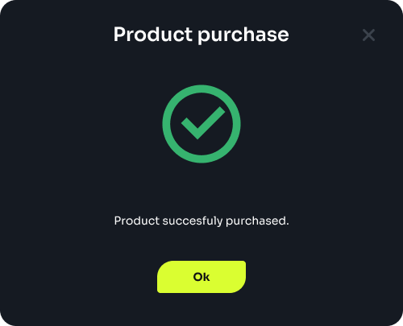
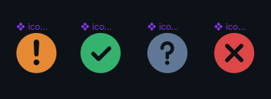
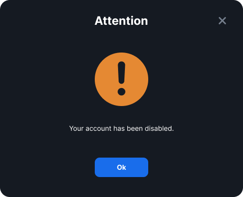
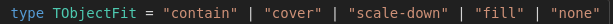

## Russian

<ul class="nav nav-tabs" role="tablist">
    <li>
        <a href="#english" role="tab" id="english-tab" data-toggle="tab" data-link="english">To English</a>
    </li>
</ul>
<div class="tab-content">

<div class="tab-pane fade active" id="c-russian">

# Message Component

Компонент создает экземпляр сообщения о событии.
Используется только в составе компонента
[notification-thread](../notification-thread/notification-thread.component.ts)

## Темы отображения (TTheme)

определяют общие стили для темы

    Default

**Разделяется на два состояния:**

isPopup


___

isModal



___

     CustomType

набор стилей переопределенных на проекте


## Модификатор темы (TThemeMode)

Применяется для добавления локальных изменений стилей (не может использоваться самостоятельно, без привязки к Теме)


## Типы сообщений

Определяют заголовок сообщения и его иконку

варианты иконок :

 

### Примеры сообщений:

- info

- success (popup)


- warning (modal)



- error (popup)


## Параметры компонента

[meesage.params.ts](message.params.ts)

```typescript
export interface IMessageParams extends IComponentParams<TTheme, TMessageType, TThemeMode> {
    showCloseButton?: boolean;
    imageFit?: TObjectFit;
    typeIcons?: {[K in TMessageType]?: string};
    defaultTitles?: {[K in TMessageType]?: string};
}

export const defaultParams: IMessageParams = {
    class: 'wlc-notification-message ',
    componentName: 'wlc-notification-message',
    moduleName: 'core',
    type: 'info',
    showCloseButton: true,
    imageFit: 'cover',
    typeIcons: {
        success: '/wlc/icons/status/ok.svg',
        warning: '/wlc/icons/status/alert.svg',
        error: '/wlc/icons/status/alert.svg',
    },
    defaultTitles: {
        info: gettext('Message'),
        success: gettext('Success'),
        warning: gettext('Warning'),
        error: gettext('Error'),
    },
}
```

- `type` - тип сообщения ( TMessageType )
- `showCloseButton` - управляет отображенем кнопки для типа isModal
- `imageFit` - при использовнии картинки вместо иконки определяет заполнение 
- `typeIcons` содержит объект с сылками на иконки, ключами является **`TMessageType`**
- `defaultTitles` содержит объект с заголовками, ключами является **`TMessageType`**


## English


<ul class="nav nav-tabs" role="tablist">
    <li class="active">
        <a href="#russian" role="tab" id="russian-tab" data-toggle="tab" data-link="russian">To Russian</a>
    </li>
</ul>
