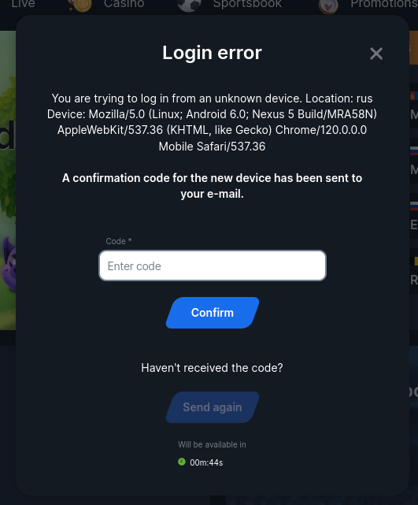
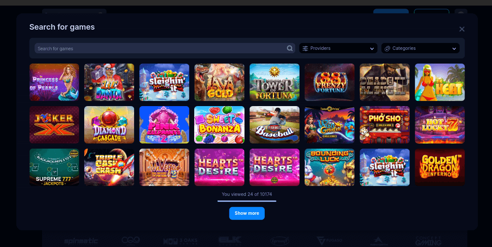
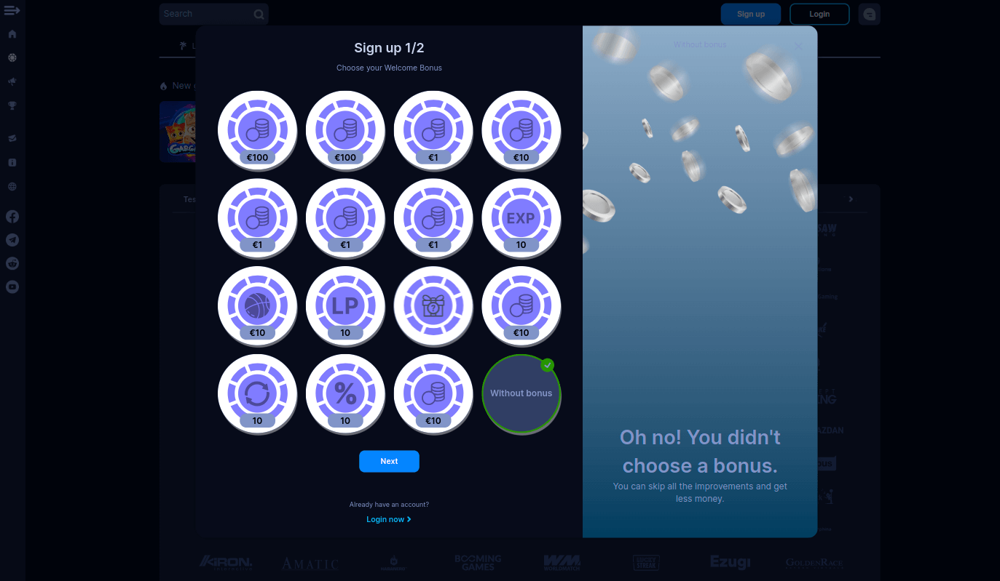

<ul class="nav nav-tabs" role="tablist">
    <li class="active">
        <a href="#russian" role="tab" id="russian-tab" data-toggle="tab" data-link="russian">Russian</a>
    </li>
    <li>
        <a href="#english" role="tab" id="english-tab" data-toggle="tab" data-link="english">English</a>
    </li>
</ul>

<div class="tab-content">
<div class="tab-pane fade active in" id="c-russian">

## Russian

# Modal component

Компонент-обертка для отображения компонента в модальном окне.
Эта обертка состоит из базовых элементов, таких как:
- `__wrapper` - элемент позволяет добавлять затемнение вокруг модального окна
- `__dialog`:
    - `__header` - заголовок модального окна
    - `__body` - выбраный компонент
    - `__footer` содержит кнопки управления

Также в [modal.params.ts](../modal/modal.params.ts) содержится список конфигов для разных модальных окон

## Варианты Отображения

ПРИМЕРЫ:








## Параметры

```ts
export const defaultParams: IModalOptions = {
    moduleName: 'core',
    componentName: 'wlc-modal-window',
    class: 'wlc-modal',
    ignoreBackdropClickBreakpoint: '(max-width: 559px)',
};
```
- `ignoreBackdropClickBreakpoint`-  отключает кликабельность по бэкдропу при ширине экрана менее заданного

```ts
export const DEFAULT_MODAL_CONFIG: Partial<IModalConfig> = {
    show: true,
    keyboard: true,
    backdrop: true,
    focus: true,
    animation: true,
    dismissAll: false,
    showFooter: true,
    size: 'md',
    useBackButton: false,
    backButtonText: '',
    closeBtnVisibility: true,
    rejectBtnVisibility: true,
    textAlign: 'left',
    withoutPadding: false,
};
```
Параметры описаны в [IModalConfig](./modal.interface.ts) > ModalOptions

## English

<ul class="nav nav-tabs" role="tablist">
    <li class="active">
        <a href="#russian" role="tab" id="russian-tab" data-toggle="tab" data-link="russian">Russian</a>
    </li>
</ul>

# Modal component

A wrapper component for displaying the component in a modal window.
This wrapper consists of basic elements, such as:
- `__wrapper` - backdrop
- `__dialog` box:
    - `__header` -
    - `__body` - current component
    - `__footer` - include control button

 It's called automatically from the `ModalService` during the calling of a modal window.

Also, [model.params.ts](../modal/model.params.ts) contains a list of configs for different modal windows

## View

Examples:


## Params

```ts
export const defaultParams: IModalOptions = {
    moduleName: 'core',
    componentName: 'wlc-modal-window',
    class: 'wlc-modal',
    ignoreBackdropClickBreakpoint: '(max-width: 559px)',
};
```
- `ignoreBackdropClickBreakpoint` -  dialog disables clickability on the backdrop when the screen width is less than the specified one

```ts
export const DEFAULT_MODAL_CONFIG: Partial<IModalConfig> = {
    show: true,
    keyboard: true,
    backdrop: true,
    focus: true,
    animation: true,
    dismissAll: false,
    showFooter: true,
    size: 'md',
    useBackButton: false,
    backButtonText: '',
    closeBtnVisibility: true,
    rejectBtnVisibility: true,
    textAlign: 'left',
    withoutPadding: false,
};
```

Thet params are described in [IModalConfig](./modal.interface.ts) > ModalOptions
