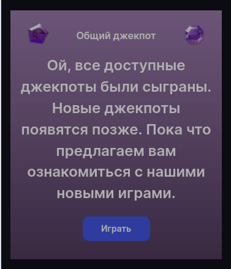
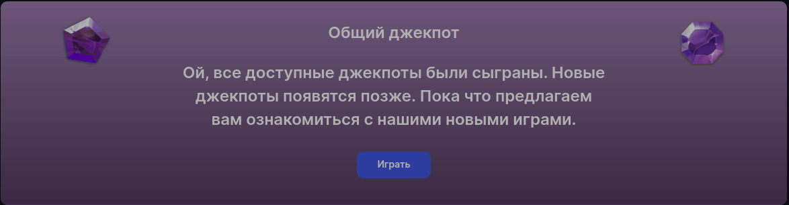

<ul class="nav nav-tabs" role="tablist">
    <li class="active">
        <a href="#russian" role="tab" id="russian-tab" data-toggle="tab" data-link="russian">Russian</a>
    </li>
    <li>
        <a href="#english" role="tab" id="english-tab" data-toggle="tab" data-link="english">English</a>
    </li>
</ul>

<div class="tab-content">
<div class="tab-pane fade active in" id="c-russian">

## Russian

# No-content Component

    Используется в соcтаве других компонентов. Отображается если в родительском компоненте отсутствуют данные для вывода.

Компонент состоит из заголовка, текстового поля и декоративных элементов.

## Варианты отображения

<table>
отображение для разрешений экрана:
    <tr>
        <th>до 899px (включительно)</th>
        <th>900px и выше</th>
    </tr>
    <tr>
        <td style="padding-right:40px;">
            
        </td>
        <td>
             
        </td>
    </tr>
    <tr>
        <td style="padding-right:40px;">
            
        </td>
        <td>
            
        </td>
    </tr>
    <tr>
        <td style="padding-right:40px;">
            
        </td>
        <td>
            
        </td>
    </tr>
    <tr>
        <td style="padding-right:40px;">
            
        </td>
        <td>
            
        </td>
    </tr>
</table>

## Параметры


```ts
'parentComponentClass' - /* описывает класс родительского компонента, в котором будет использоваться  компонент no-content*/
'title' - /* Задает поле Title, если родительский компонент не имеет такого поля */
'text' - /* Задает поле Text, если родительский компонент не имеет такого поля */
'redirectBtn' -  /* настройки для кнопки редиректа, включают активацию кнопки, указание пути редиректа и текст кнопки */
'link' - /* настройки для ссылки редиректа, включают активацию ссылки, указание пути редиректа */
'bgImage' - /* задает картинку бэкграунда */
'decorImage' - /* задает картинку декора */
'decorParams': {
    'useDecorInside' -  /* Параметры для использования декора в блоке контента */
    'useInline' - /* использование картинки инлайн (только для SVG !!!) */
},
```

## English

<ul class="nav nav-tabs" role="tablist">
    <li class="active">
        <a href="#russian" role="tab" id="russian-tab" data-toggle="tab" data-link="russian">Russian</a>
    </li>
</ul>

# No-content Component

    It`s used as part of other components. It`s displayed if there is no output data in the parent component.

The component consists of a header, a text field, and decorative elements.

## View

<table>
display for screen resolutions
    <tr>
        <th>before 899px</th>
        <th>after 900px</th>
    </tr>
    <tr>
        <td style="padding-right:40px;">
            
        </td>
        <td>
             
        </td>
    </tr>
    <tr>
        <td style="padding-right:40px;">
            
        </td>
        <td>
            
        </td>
    </tr>
    <tr>
        <td style="padding-right:40px;">
            
        </td>
        <td>
            
        </td>
    </tr>
    <tr>
        <td style="padding-right:40px;">
            
        </td>
        <td>
            
        </td>
    </tr>
</table>

## Params

```ts
    `parentComponentClass` - /* describes in which component was used no-content component */
    `title` -  /* set title of empty state */
    `text` -  /* set text of empty state */
    `redirectBtn` - /* set bnts config, and where it should redirect */
    `link` - /* set link config, and where it should redirect */
    `bgImage` - /* set background image of empty content */
    `decorImage` -  /* set decor image of empty content */
    `decorParams`: {
        `useDecorInside` - /* Params for using decor inside content block */
        `useInline` - /* use decor picture inline (for svg pictures only) */
    }
```
