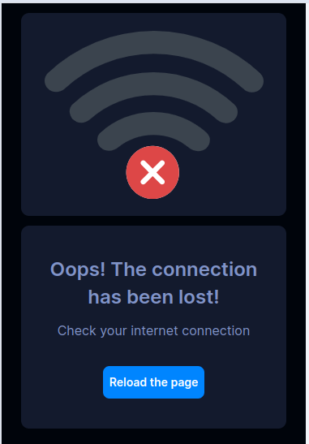
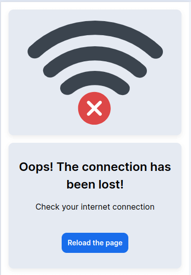
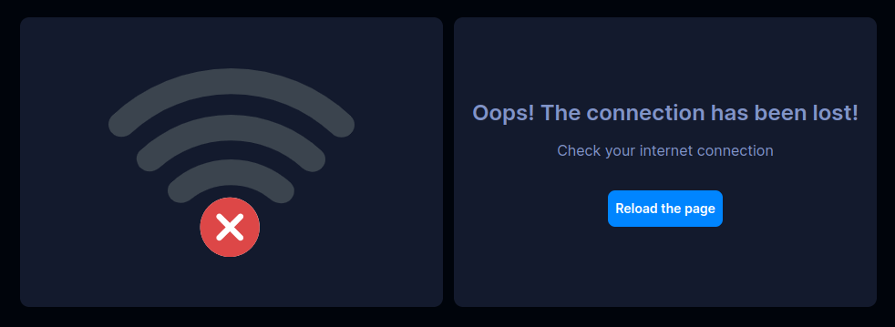
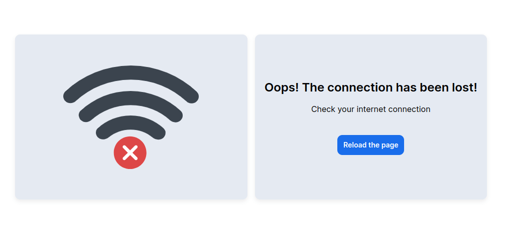

<ul class="nav nav-tabs" role="tablist">
    <li class="active">
        <a href="#russian" role="tab" id="russian-tab" data-toggle="tab" data-link="russian">Russian</a>
    </li>
    <li>
        <a href="#english" role="tab" id="english-tab" data-toggle="tab" data-link="english">English</a>
    </li>
</ul>

<div class="tab-content">
<div class="tab-pane fade active in" id="c-russian">

## Russian

# Offline-page Component

    Компонент, отображаемый на специальном стейте `app.offline`, на который происходит редирект при потере соединения с сетью интернет.
    При восстановлении доступа к сети происходит автоматический возврат к разделу сайта, на котором находился пользователь до потери соединения.

Компонент содержит текстовое сообщение и изображение, уведомляющие о потере соединения с сетью.
Изображение может быть заменено через конфиги.
Текстовое сообщение задаётся в темплейте компонента.

## Варианты Отображения

<table>
    <tr>
        <th >
            Тип отображения
        </th>
        <th >
            Темная тема
        </th>
        <th>
            Светлая тема
        </th>
    </tr>
    <tr>
        <td>
            Мобильное устройство
        </td>
        <td>
            
        </td>
        <td>
            
        </td>
    </tr>
    <tr>
        <td>
            Десктоп
        </td>
        <td>
            
        </td>
        <td>
            
        </td>
    </tr>
</table>

## Параметры

```ts
    `modifiers` - /* Модификатор, применяемый для стилизации компонента на проекте */
    `common?`: {
        `themeMod` - /* модификатор темы, применяемой на проекте */
    };
    `image?` - /* путь до изображения */
```

## English

<ul class="nav nav-tabs" role="tablist">
    <li class="active">
        <a href="#russian" role="tab" id="russian-tab" data-toggle="tab" data-link="russian">Russian</a>
    </li>
</ul>

# Offline-page component

    The component displayed on the special `app.offline` state, which is redirected to, when the Internet connection is lost.
    When network access is restored, it automatically returns to the section of the site where the user was before the connection was lost.

The component contains a text message and an image notifying about the loss of connection to the network.
The image can be replaced using config.
The text message is set in the component template.

## View

<table>
    <tr>
        <th >
            View
        </th>
        <th >
            | Dark theme
        </th>
        <th>
            | White theme
        </th>
    </tr>
    <tr>
        <td>
            mobile
        </td>
        <td>
            
        </td>
        <td>
            
        </td>
    </tr>
    <tr>
        <td>
            desktop
        </td>
        <td>
            
        </td>
        <td>
            
        </td>
    </tr>
</table>

## Params

```ts
    `modifiers` - /* A modifier used to style a component in the project */
    `common?`: {
        `themeMod` - /* A modifier of theme used in the project */
    };
    `image?` - /* Path to the image */
```
