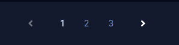

<ul class="nav nav-tabs" role="tablist">
    <li>
        <a href="#english" role="tab" id="english-tab" data-toggle="tab" data-link="english">English</a>
    </li>
        <li class="active">
        <a href="#russian" role="tab" id="russian-tab" data-toggle="tab" data-link="russian">Russian</a>
    </li>
</ul>

### Russian

# Pagination Component

**!! Может использоваться только с компонентом списка.**\
Принимает как параметр список элементов, разбивает список на страницы с указанным количеством элементов на странице.\
Передает в компонент списка номер страницы для отрисовки и количество отображаемых элементов на странице.\
Так же включает в себя компоненты кнопки для переключения между страницами.
Отображает номер текущей страницы и номера предыдущей/следующей страницы.

используется в:

- [bonuses-list.component](../../../bonuses/components/bonuses-list/bonuses-list.component.html)
- [cashback-rewards.component](../../../cashback/components/cashback-rewards/cashback-rewards.component.html)
- [table.component](../../../core/components/table/table.component.html)
- [achievement-list.component](../../../loyalty/submodules/achievements/components/achievement-list/achievement-list.component.html)
- [store-list.component](../../../store/components/store-list/store-list.component.html)
- [tournament-list.component](../../../tournaments/components/tournament-list/tournament-list.component.html)

## Темы отображения

    'default'

___

    'wolf'

## Входящие параметры

- `theme` - определяет тему компонента;
- `items` - массив элементов, переданных в компонент;
- `totalItems` - общее количество элементов переданных в компонент;
- `itemPerPage` - количество элементов отображаемых на странице;
- `pageChanged` - принимает функцию, определяющую логику измененеия компонента (если не передана, применяется дефолтная функция(логика));
- `settings` - настройки компонента, включающие в себя параметры:
    - `use` - отображает компонент (true/false);
    - `itemPerPage` - количество элементов на странице (получаем из конфигов);
- `hidden` - скрывает компонент если нет элементов, или их количество помещается на одной странице, или установлен параметр - скрывать пагинацию;

### English
