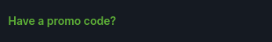
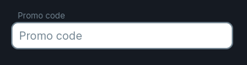
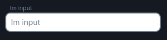
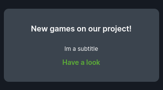

<ul class="nav nav-tabs" role="tablist">
    <li class="active">
        <a href="#english" role="tab" id="english-tab" data-toggle="tab" data-link="english">English</a>
    </li>
    <li>
        <a href="#russian" role="tab" id="russian-tab" data-toggle="tab" data-link="russian">Russian</a>
    </li>
</ul>
<div class="tab-content">
<div class="tab-pane fade active in" id="c-english">

## English

# Promocode-link Component
Component which includes two child elements: input-block (registrationPromoCode) and link-block (linkPromoCode).


**Has two states:**

`showPromoCode = false`

Shows link-block in DOM



___

`showPromoCode = true`

Shows input-block in DOM


---

## Params

- **linkPromoCode**: link to [docs](../link-block/link-block.component.md)
- **registrationPromoCode**: link to [docs](../input/input.component.md)
---
### Default params

```typescript
export const defaultParams: Partial<IPromoCodeLinkCParams> = {
    class: 'wlc-promocode-link',
    componentName: 'wlc-promocode-link',
    moduleName: 'core',
    linkPromoCode: {
        wlcElement: 'block_link_promocode',
        common: {
            link: gettext('Have a promo code?'),
        },
    },
    registrationPromoCode: _cloneDeep(FormElements.promocode.params),
};
```
### Using component

```ts
    class: 'wlc-promocode-link',
    componentName: 'wlc-promocode-link',
    moduleName: 'core',
    linkPromoCode: {
        wlcElement: 'block_link_promocode',
        themeMod: 'secondary',
        common: {
            link: gettext('Have a promo ?'),
            title: gettext('Im a title'),
            subtitle: gettext('Im a subtitle'),
            useInteractiveText: true,
            useLinkButton: true,
        },
    },
    registrationPromoCode: {
        wlcElement: 'block_promocode',
        common: {
            placeholder: gettext('Im input'),
            customModifiers: 'promocode',
        },
        name: 'registrationPromoCode',
    },
```
### Applied styles

**input-block (registrationPromoCode)**



```ts
registrationPromoCode: {
    common: {
        placeholder: gettext('Im input'),
    }
}
```
---
**link-block (linkPromoCode)**


```ts
linkPromoCode: {
    themeMod: 'secondary',
    common: {
        subtitle: gettext('Im a subtitle'),
        useInteractiveText: true,
        useLinkButton: true,
    }
}
```


---

</div>
<div class="tab-pane fade" id="c-russian">


## Russian
# Promocode-link Component
Компонент, который включает в себя два дочерних элемента: input блок (registrationPromoCode) и блок-ссылку (linkPromoCode).

**Разделяется на два состояния:**

`showPromoCode = false`

Отображает блок-ссылку в DOM дереве


___

`showPromoCode = true`

Отображает input-блок в DOM дереве


## Параметры

- **linkPromoCode**: ссылка на [документацию](../link-block/link-block.component.md)
- **registrationPromoCode**: ссылка на [документацию](../input/input.component.md)
---

### Дефолтные параметры
```typescript
export const defaultParams: Partial<IPromoCodeLinkCParams> = {
    class: 'wlc-promocode-link',
    componentName: 'wlc-promocode-link',
    moduleName: 'core',
    linkPromoCode: {
        wlcElement: 'block_link_promocode',
        common: {
            link: gettext('Have a promo code?'),
        },
    },
    registrationPromoCode: _cloneDeep(FormElements.promocode.params),
};
```
### Использование компонента

```ts
class: 'wlc-promocode-link',
    componentName: 'wlc-promocode-link',
    moduleName: 'core',
    linkPromoCode: {
        wlcElement: 'block_link_promocode',
        themeMod: 'secondary',
        common: {
            link: gettext('Have a promo ?'),
            title: gettext('Im a title'),
            subtitle: gettext('Im a subtitle'),
            useInteractiveText: true,
            useLinkButton: true,
        },
    },
    registrationPromoCode: {
        wlcElement: 'block_promocode',
        common: {
            placeholder: gettext('Im input'),
            customModifiers: 'promocode',
        },
        name: 'registrationPromoCode',
    },
```
---

### Применённые стили

**input-блок (registrationPromoCode)**


```ts
registrationPromoCode: {
    common: {
        placeholder: gettext('Im input'),
    }
}
```
---
**блок-ссылка (linkPromoCode)**


```ts
linkPromoCode: {
    themeMod: 'secondary',
    common: {
        subtitle: gettext('Im a subtitle'),
        useInteractiveText: true,
        useLinkButton: true,
    }
}
```


</div>
</div>
