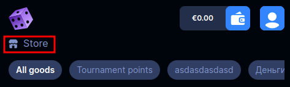
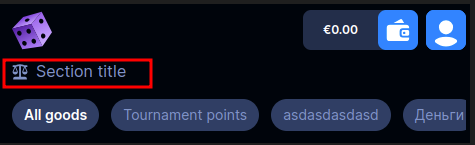
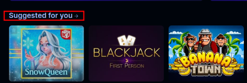

<ul class="nav nav-tabs" role="tablist">
    <li class="active">
        <a href="#english" role="tab" id="english-tab" data-toggle="tab" data-link="english">English</a>
    </li>
    <li>
        <a href="#russian" role="tab" id="russian-tab" data-toggle="tab" data-link="russian">Russian</a>
    </li>
</ul>
<div class="tab-content">
<div class="tab-pane fade active in" id="c-english">

## English

# Section-title Component
Title of sections

 **Default view**



---

## Params

- **text**: `string` - name of section
- **iconPath**: `string` - icon next to the name
- **iconFallback**: `string` - display icon when **iconPath** has wrong path
- **arrowLinkIconPath**: `string` - arrow icon next to component, when `useAsTitle: true` and `noUseArrowLinkIcon: false` and must be wrapped by tag `<a>`
- **noUseArrowLinkIcon**: `boolean` - used with  **arrowLinkIconPath** when set to `false`
---
### Default params

```typescript
export const defaultParams: ISectionTitleCParams = {
    class: 'wlc-section-title',
    componentName: 'wlc-section-title',
    moduleName: 'core',
    arrowLinkIconPath: '/wlc/icons/arrow-right.svg',
};
```
### Using component

```ts
name: 'core.wlc-section-title',
params: {
    theme: 'wolf',
    text: 'Section title',
    iconPath: 'wlc/icons/european/v3/fairnessss.svg',
    iconFallback: 'wlc/icons/european/v3/custom.svg',
},
```

</div>
<div class="tab-pane fade" id="c-russian">

---
## Russian
# Section-title Component
Заголовок секций

## Параметры

- **text**: `string` - название секции
- **iconPath**: `string` - иконка рядом с названием
- **iconFallback**: `string` - отображает иконку при неправильном пути в **iconPath**
- **arrowLinkIconPath**: `string` - иконка стрелки справа от компонента, при `useAsTitle: true` и `noUseArrowLinkIcon: false`, и должен быть обёрнут в тег `<a>`
- **noUseArrowLinkIcon**: `boolean` - применяется вместе с **arrowLinkIconPath** при значении `false`

---
### Дефолтные параметры
```typescript
export const defaultParams: ISectionTitleCParams = {
    class: 'wlc-section-title',
    componentName: 'wlc-section-title',
    moduleName: 'core',
    arrowLinkIconPath: '/wlc/icons/arrow-right.svg',
};
```
### Использование компонента

```ts
name: 'core.wlc-section-title',
params: {
    theme: 'wolf',
    text: 'Section title',
    iconPath: 'wlc/icons/european/v3/fairnessss.svg',
    iconFallback: 'wlc/icons/european/v3/custom.svg',
},
```
---

**Применённые стили**



---
```ts
arrowLinkIconPath: '/wlc/icons/arrow-2.svg',
noUseArrowLinkIcon: false,
```


</div>
</div>
