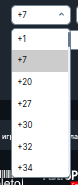
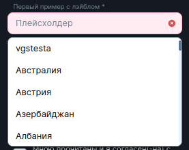
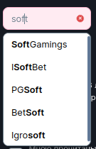
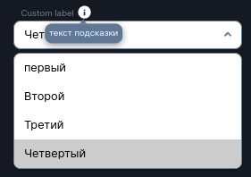

<ul class="nav nav-tabs" role="tablist">
    <li class="active">
        <a href="#russian" role="tab" id="russian-tab" data-toggle="tab" data-link="russian">Russian</a>
    </li>
    <li>
        <a href="#english" role="tab" id="english-tab" data-toggle="tab" data-link="english">English</a>
    </li>
</ul>

<div class="tab-content">
<div class="tab-pane fade active in" id="c-russian">

## Russian
---

# Select component

#### Компонент представляет собой элемент управления, предоставляющий меню параметров



---

### Управляемые параметры из интерфейса `ISelectCParams`:
Использовать:
```ts
    name: 'core.wlc-select',
    params: {
        // параметры описанные ниже
    }
```

## Params

- **name: `string`** - Параметр устанавливает значение для атрибутов `id`, `name`, генерирует значение в `data-wlc-element="select_[name]"`

* **value?: `V`** - Устанавливает значение по умолчанию

* **id?: `string`** - Если указан, то перезапишет значение в атрибуте `id`

* **common?**
    * **placeholder?: `string | number`** - Текст плейсхолдера в select
    * **customModifiers?: `CustomMod`** - Доп. кастомный класс родительскому host-тэгу
    * **tooltipText?: `string`**  - Текст подсказки
    * **tooltipIcon?: `string`**  - Иконка подсказки
    * **tooltipModal?: `string`** - Название готового модального окна из [MODALS_LIST](../modal/modal.params.ts). По клику на тултип открывается заданное модальное окно
    * **tooltipMod?: `TooltipThemeMod`** - Тип подсказки
    * **tooltipModalParams?: `IIndexing<string>`** - Параметры кастомного модального окна
        *    *`Ниже ссылка на документацию tooltip-компонента`*

* **autocomplete?: `string`** - Значения 'on / off'. Позволяет сохранить ранее введенные данные, чтобы в следующий раз подставить их автоматически

* **validators?: `ValidatorType[]`** - Массив валидаторов. Обычно используется 'required - обязательный'

* **control?: `UntypedFormControl`** - Тип контрола для работы с формой

* **disabled?: `boolean`** - В данный момент не используется. Состояние disable применяется с помощью 'control.disabled'

* **locked?: `boolean | string[]`** - Не используется

* **labelText?: `string`** - Устанавливает текст над селектом

* **options?: `string`** - Элементы, которые будут находиться в дропдауне селекта
В качестве строки передается название готового сета элементов, сгенерированных в сервисе. Список готовых сетов:

    * **currencies** - Валюты
    * **countries** - Страны
    * **countryStates** - Штаты или другие области определенной страны
    * **phoneCodes** - Коды телефонных номеров разных стран
    * **genders** - Половая принадлежность (мужской/женский)
    * **birthDay** - Дни месяца
    * **birthMonth** - Месяца года
    * **birthYear** - Годы
    * **pep** - Варианты `Да / Нет`, соответственно возвращающие `true / false`
    * **merchants** - Игровые провайдеры

* **items?: `ISelectOptions<V>[]`** - Создание своих кастомных элементов выпадающего списка. Выглядит следующим образом:

```ts
    items: [
        {
            value: unknown; - Опциональное значение
            title: string | number - Выводимый текст элемента
        }
    ],
```

* **useSearch?: `boolean`** - Разрешить вводить в селект текст с клавиатуры для поиска элемента

* **insensitiveSearch?: `boolean`** - Поиск без учёта регистра

* **noResultText?: `string`** - Показывает текст, если не найдено элементов по ручному поиску

* **autoSelect?: `boolean`** - Устаналивает по умолчанию валюту, код страны или телефонный код страны, в зависимости с какой страны был вход на сайт

* **useIcon?: `boolean`** - Использовать иконки

* **updateOnControlChange?: `boolean`** - Обновлять значение если контрол был изменен снаружи


[Документация по tooltip компоненту](../tooltip/tooltip.component.md)

---
### Дефолтного состояния нет, так как компонент используется по определенному назначению

#### Примеры нескольких вариантов:
##### first
```ts
    params: {
        labelText: gettext('Первый пример с лэйблом'),
        wlcElement: 'countries',
        customMod: 'country',
        common: {
            placeholder: gettext('Плейсхолдер'),
        },
        name: 'countries',
        validators: ['required'],
        options: 'countries',
    },
```


---
##### second
```ts
    params: {
        name: 'merchants',
        options: 'merchants',
        useSearch: true,
        insensitiveSearch: true,
    },
```


---
##### third
```ts
    params: {
        labelText: 'Custom label',
        common: {
            tooltipText: 'текст подсказки',
        },
        name: 'customOptions',
        items: [
            {
                value: 'first',
                title: 'первый',
            },
            {
                value: 'second',
                title: 'Второй',
            },
            {
                value: 'third',
                title: 'Третий',
            },
            {
                value: 'fourth',
                title: 'Четвертый',
            },
        ],
    },
```

