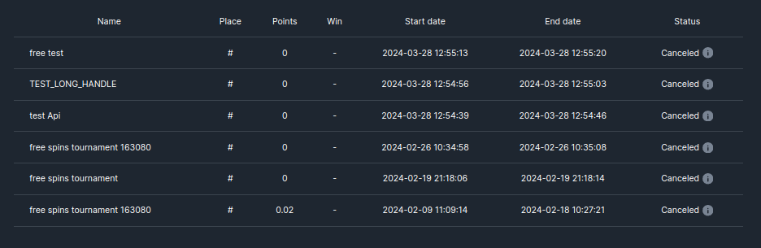
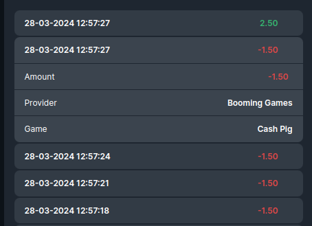

<ul class="nav nav-tabs" role="tablist">
    <li class="active">
        <a href="#english" role="tab" id="english-tab" data-toggle="tab" data-link="english">English</a>
    </li>
    <li>
        <a href="#russian" role="tab" id="russian-tab" data-toggle="tab" data-link="russian">Russian</a>
    </li>
</ul>
<div class="tab-content">
<div class="tab-pane fade active in" id="c-english">

# Table Component

### Компонент генерирует конфигурируемую таблицу

##### Пример сгенерированной таблицы истории турниров


##### Компактный вид таблицы

---
## TODO: Update the documentation after refactoring
### Параметры

* **head**: `ITableCol[]` - Генерация колонок. Описание интерфейса `ITableCol` приведено ниже

* **rows**: `unknown[] | BehaviorSubject<unknown[]>` - Данные, которые будут выводиться в ряду

* **pagination**: `IPagination` - Разделение контента на страницы. При выключенном параметре все строки таблицы будут выводиться на одной странице
```ts
    pagination: {
        use: boolean, // Использовать ли пагинацию
        breakpoints: {
            [key: string]: { // Ширина экрана с которой выводится количество рядов на странице
                itemPerPage: number // количество рядов на одной странице
            },
        },
    },
```

* **iconPath**: `string` - Путь к изображению, которое будет выведено при отсутствии контента таблицы (Например если история турниров пуста, то пустое пространство заполнит изображение)

* **switchWidth**: `number` - Значение ширины экрана, при котором таблица примет компактный вид

### Параметры `ITableCol`

* **key**: `string` - Значение поля в переданном объекте данных, из которого будут выведены данные в соответствующую колонку. И создает дополнительный класс-модификатор вида: `wlc-table__cell-[key]` для колонки, в которой все ячейки будут иметь заданный класс-модификатор

* **title**: `string` - Заголовок для колонки

* **type**: `TableColType` - Тип используемой колонки
    * text
    * date
    * index
    * amount
    * component

* **order**: `number` - Установить номер очереди в ряду для колонки. Расстановка колонок будет происходить от меньшего к большему номеру

* **mapValue**: `fn` - функция для преобразования значений колонки

* **component**: `string` - Компонент, используемый в колонке таблицы. Передается в виде строки в формате `'${moduleName}.${componentName}'`. Например: `'core.wlc-history-name'`. Альтернатива параметру **componentClass**

* **componentClass**: `unknown` - Компонент, используемый в колонке таблицы

* **wlcElement**: `string` - Для автотестов. Создает дата-атрибут с оригинальным значением

* **description**: `string` - Описание колонки. Требуется иметь в виду, что текст выводится под таблицей

* **currencyUseIcon**: `boolean` - Использовать ли иконку. Применяется вместе с компонентом `Currency`
---

### Дефолтные параметры

```ts
export const defaultParams: ITableCParams = {
    class: 'wlc-table',
    componentName: 'wlc-table',
    moduleName: 'core',
    pageCount: 10,
    pagination: {
        use: true,
        breakpoints: {
            0: {
                itemPerPage: 10,
            },
        },
    },
    switchWidth: 1024,
    iconPath: '/wlc/icons/empty-table-bg.svg',
};
```

#### Пример конфига для генерации таблицы истории ставок

```ts
export const betHistoryTableHeadConfig: ITableCol[] = [
    {
        key: 'Date',
        title: gettext('Bet time'),
        type: 'component',
        order: 10,
        mapValue: (item: Bet) => ({bet: item}),
        componentClass: BetPreviewComponent,
        wlcElement: 'wlc-profile-table__cell_time',
    },
    {
        key: 'Amount',
        title: gettext('Amount'),
        type: 'amount',
        currencyUseIcon: true,
        order: 20,
        wlcElement: 'wlc-profile-table__cell_amount',
    },
    {
        key: 'Merchant',
        title: gettext('Provider'),
        type: 'text',
        order: 30,
        wlcElement: 'wlc-profile-table__cell_merchant',
    },
    {
        key: 'GameName',
        title: gettext('Game'),
        type: 'text',
        order: 40,
        wlcElement: 'wlc-profile-table__cell_game',
    },
];
```
