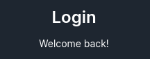
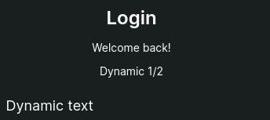
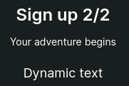

<ul class="nav nav-tabs" role="tablist">
    <li class="active">
        <a href="#english" role="tab" id="english-tab" data-toggle="tab" data-link="english">English</a>
    </li>
    <li>
        <a href="#russian" role="tab" id="russian-tab" data-toggle="tab" data-link="russian">Russian</a>
    </li>
</ul>
<div class="tab-content">
<div class="tab-pane fade active in" id="c-english">

## English

# Text-block Component
Block which contains text

 **Default view**



---

## Params

- **common**:
    * **textBlockTitle**: `'string'` - title of the text block
    * **textBlockSubtitle**: `'string' | 'string[]'` - subtitle of the text block
    * **textBlockText**: `'string'` - text of the block
    * **titleDynamicText**:  dynamic text next to title
        - **param**: `'string'` - text changes dynamically
        - **textDefault**: `'string'` - display default text, provided **param** unspecified
    * **dynamicText**:  block which contains dynamic text
        - **text**: `'string'` - static description of block
        - **textDefault**: `'string'` - display default text, provided **param** unspecified
        - **param**: `'string'` - text changes dynamically
---
### Default params

```typescript
export const defaultParams: ITextBlockCParams = {
    moduleName: 'user',
    componentName: 'wlc-text-block',
    class: 'wlc-text-block',
    common: {},
};
```
### Using component

```ts
name: 'core.wlc-text-block',
params: <ITextBlockCParams>{
    common: {
        textBlockTitle: gettext('Sign in'),
        textBlockSubtitle: gettext('Welcome back!'),
        textBlockText: gettext('Dynamic text'),
        titleDynamicText: {
            param: '',
            textDefault: gettext(''),
        },
        dynamicText: {
            text: gettext('Dynamic'),
            textDefault: gettext('text'),
            param: 'regStepsCounter',
        },
    },
},
```

</div>
<div class="tab-pane fade" id="c-russian">

---
## Russian
# Text-block Component
Блок, содержащий текстовые поля

## Параметры

- **common**:
    * **textBlockTitle**: `'string'` - заголовок блока с текстом
    * **textBlockSubtitle**: `'string' | 'string[]'` - подзаголовок блока с текстом
    * **textBlockText**: `'string'` - текст блока
    * **titleDynamicText**:  динамический текст рядом с заголовком
        - **param**: `'string'` - динамически меняющийся текст
        - **textDefault**: `'string'` - выводит текст по умолчанию, если не передан param
    * **dynamicText**:  блок динамического текста
        - **text**: `'string'` - статическое описание самого блока
        - **textDefault**: `'string'` - выводит текст по умолчанию, если не передан param
        - **param**: `'string'` - динамически меняющийся текст
---

### Дефолтные параметры
```typescript
export const defaultParams: ITextBlockCParams = {
    moduleName: 'user',
    componentName: 'wlc-text-block',
    class: 'wlc-text-block',
    common: {},
};
```
### Использование компонента

```ts
name: 'core.wlc-text-block',
params: <ITextBlockCParams>{
    common: {
        textBlockTitle: gettext('Sign in'),
        textBlockSubtitle: gettext('Welcome back!'),
        textBlockText: gettext('Dynamic text'),
        titleDynamicText: {
            param: '',
            textDefault: gettext(''),
        },
        dynamicText: {
            text: gettext('Dynamic'),
            textDefault: gettext('text'),
            param: 'regStepsCounter',
        },
    },
},
```
---

**Применённые стили**


---

Применение **titleDynamicText** и **dynamicText**




</div>
</div>
