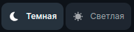
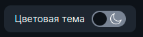
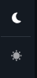

<ul class="nav nav-tabs" role="tablist">
    <li>
        <a href="#english" role="tab" id="english-tab" data-toggle="tab" data-link="english">English</a>
    </li>
        <li class="active">
        <a href="#russian" role="tab" id="russian-tab" data-toggle="tab" data-link="russian">Russian</a>
    </li>
</ul>

### Russian

<div class="tab-content">

<div class="tab-pane fade active" id="c-russian">

# Theme-toggler Component

    Переключает набор стилей для всего проекта.

### Примеры использования:

- [header.sections](../../system/config/layouts/sections/header.section.ts)
- [footer.sections](../../system/config/layouts/sections/footer.section.ts)
- [left-panel.sections](../../system/config/layouts/sections/left-panel.section.ts)

### Пример подключения в header.section:

```typescript
    export const defThemeToggler: ILayoutSectionConfig = {
        ...
        components: [
            ...
            componentLib.wlcThemeToggler.vertical,
            ...
        ],
    };
```


## Темы отображения

    'default'


    'alternative'



    'long'



## Модификаторы Темы

    'default'


    'compact'

<table>
   <thead>
        <tr>
            <th>default</th>
            <th>alternative</th>
        </tr>
    </thead>
    <tbody>
        <tr>
            <td style="padding-right:40px;">
                
            </td>
                        <td>
                
            </td>
        </tr>
    </tbody>
</table>

    'vertical'


## Входящие параметры

```typescript
export interface IThemeTogglerCParams extends IComponentParams<ComponentTheme, ComponentType, ComponentThemeMod> {
    title?: string;
    darkTitle?: string;
    lightTitle?: string;
    compactMod?: boolean;
};

export const defaultParams: IThemeTogglerCParams = {
    class: 'wlc-theme-toggler',
    componentName: 'wlc-theme-toggler',
    moduleName: 'core',
    title: gettext('Color theme'),
    darkTitle: gettext('Dark'),
    lightTitle: gettext('Light'),
    compactMod: false,
};
```

- `'title'` - заголовок для темы `'long'`
- `'darkTitle'` - название дефолтного состояния для темы `'alternative'`
- `'lightTitle'` - название альтернативного состояния для темы `'alternative'`
- `'compactMod'` - `true`/`false` размер компонента (`'def'` / `'defCompact'`)
- `'type'` - имеет значения 'default' и 'inverse'
    - `'inverse'` - меняет местами иконки тем
- `'compactMod'` - ( хранит состояние компонента, при использовании в других компонентах, меняет отображение компонента при изменении состояния родительского компонента) / _нужен рефакторинг_ ?

### English
