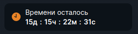
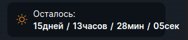
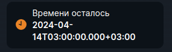

<ul class="nav nav-tabs" role="tablist">
    <li class="active">
        <a href="#english" role="tab" id="english-tab" data-toggle="tab" data-link="english">English</a>
    </li>
    <li>
        <a href="#russian" role="tab" id="russian-tab" data-toggle="tab" data-link="russian">Russian</a>
    </li>
</ul>
<div class="tab-content">
<div class="tab-pane fade active in" id="c-english">

## English

# Timer Component
Component which counts down the time until any event starts.

 **Default view**


---

## Params

- **common**:
    * **noCountDown**: `boolean` - stops timer, showing the date of the event, instead of counting down
    * **value**: `string` | `DateTime` - sets a specific date
    * **text**: `string` - text above the timer
    * **countUp**: `boolean` - if 'true', counts time from scratch, increasing it (use in component 'wlc-reality-check-info')
    * **noDays**: `boolean` - if 'true', stop display days, when its number is 0
    * **noHours**: `boolean` - stops counting hours and counts minutes instead
    * **serverDateUTC**: `number` - displays server time from Response Headers of http-request (local time of user is displayed by default)
- **acronyms**:
    * **days**: `string` - title for days in timer
    * **hours**: `string` - title for hours in timer
    * **minutes**: `string` - title for minutes in timer
    * **seconds**: `string` - title for seconds in timer
- **dividers**:
    * **units**: `string` - number separators
    * **text**: `string` - text between number and acronym
- **iconPath**: `string` - icon on the left of timer

---
### Default params

```typescript
export const defaultParams: ITimerCParams = {
    class: 'wlc-timer',
    componentName: 'wlc-timer',
    moduleName: 'core',
    iconPath: '/wlc/icons/clock.svg',
    acronyms: {
        days: gettext('d'),
        hours: gettext('h'),
        minutes: gettext('m'),
        seconds: gettext('s'),
    },
    dividers: {
        units: ':',
        text: '',
    },
};
```
### Using a component

```ts
export const defaultParams: ITimerCParams = {
    class: 'wlc-timer',
    componentName: 'wlc-timer',
    moduleName: 'core',
    iconPath: '/wlc/icons/theme-toggler-default.svg',
    common: {
        text: 'Осталось:',
    },
    acronyms: {
        days: gettext('дней'),
        hours: gettext('часов'),
        minutes: gettext('мин'),
        seconds: gettext('сек'),
    },
    dividers: {
        units: '/',
        text: '',
    },
};
```

</div>
<div class="tab-pane fade" id="c-russian">

---
## Russian
# Timer Component
Компонент, который отсчитывает время до начала какого-либо события.

## Параметры

- **common**:
    * **noCountDown**: `boolean` - останавливает таймер, показывая дату события, вместо отсчёта
    * **value**: `string` | `DateTime` - устанавливает определённую дату
    * **text**: `string` - текст над таймером
    * **countUp**: `boolean` - если 'true', таймер считает от определенного момента, увеличивая время (используется в компоненте 'wlc-reality-check-info')
    * **noDays**: `boolean` - если 'true', перестаёт отображать дни, когда их количество равно 0
    * **noHours**: `boolean` - отключает подсчёт часов в таймере, отображая их в минутах
    * **serverDateUTC**: `number` - показывает серверное время из Response Headers http-запроса (дефолтно отображается локальное время операционной системы пользователя)
- **acronyms**:
    * **days**: `string` - обозначение дней в таймере
    * **hours**: `string` - обозначение часов в таймере
    * **minutes**: `string` - обозначение минут в таймере
    * **seconds**: `string` - обозначение секунд в таймере
- **dividers**:
    * **units**: `string` - разделители между числами
    * **text**: `string` - текст между числом и акронимом
- **iconPath**: `string` - иконка слева от таймера

---
### Дефолтные параметры

```typescript
export const defaultParams: ITimerCParams = {
    class: 'wlc-timer',
    componentName: 'wlc-timer',
    moduleName: 'core',
    iconPath: '/wlc/icons/clock.svg',
    acronyms: {
        days: gettext('d'),
        hours: gettext('h'),
        minutes: gettext('m'),
        seconds: gettext('s'),
    },
    dividers: {
        units: ':',
        text: '',
    },
};
```
### Использование компонента

```ts
export const defaultParams: ITimerCParams = {
    class: 'wlc-timer',
    componentName: 'wlc-timer',
    moduleName: 'core',
    iconPath: '/wlc/icons/theme-toggler-default.svg',
    common: {
        text: 'Осталось:',
    },
    acronyms: {
        days: gettext('дней'),
        hours: gettext('часов'),
        minutes: gettext('мин'),
        seconds: gettext('сек'),
    },
    dividers: {
        units: '/',
        text: '',
    },
};
```

**Варианты отображения**

Использование компонента:


---

```ts
noCountDown: true
```



</div>
</div>
