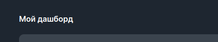
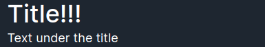

<ul class="nav nav-tabs" role="tablist">
    <li class="active">
        <a href="#english" role="tab" id="english-tab" data-toggle="tab" data-link="english">English</a>
    </li>
    <li>
        <a href="#russian" role="tab" id="russian-tab" data-toggle="tab" data-link="russian">Russian</a>
    </li>
</ul>
<div class="tab-content">
<div class="tab-pane fade active in" id="c-english">

## English

# Title Component
Сomponent displaying a customizable title.

 **Default view**


---

## Params

- **mainText**: `string | BehaviorSubject<string>` - title text
- **secondText**: `string | BehaviorSubject<string>` - text under the title
- **indexShift**: `number` - (deprecated) don't used anywhere
- **common**:
    * **mainTag**: `'div' | 'h1' | 'h2' | 'span' | CustomType` - html-tag of title
    * **secondTag**: `'div' | 'h1' | 'h2' | 'span' | CustomType` - html-tag of text under the title
---
### Default params

```typescript
export const defaultParams: ITitleCParams = {
    class: 'wlc-title',
    common: {
        mainTag: 'div',
        secondTag: 'div',
    },
};
```
### Using component

```ts
{
    name: 'core.wlc-title',
    params: {
        class: 'wlc-title',
        mainText: 'Title!!!',
        secondText: 'Text under the title',
        common: {
            mainTag: 'h2',
            secondTag: 'span',
        },
    },
}
```

</div>
<div class="tab-pane fade" id="c-russian">

---
## Russian
# Title Component
Компонент, выводящий настраиваемый заголовок.

## Параметры

- **mainText**: `string | BehaviorSubject<string>` - Текст заголовка
- **secondText**: `string | BehaviorSubject<string>` - текст под заголовком
- **indexShift**: `number` - (deprecated) нигде не применяется
- **common**:
    * **mainTag**: `'div' | 'h1' | 'h2' | 'span' | CustomType` - html-тэг заголовка
    * **secondTag**: `'div' | 'h1' | 'h2' | 'span' | CustomType` - html-тэг текста под заголовком
---
### Дефолтные параметры
```typescript
export const defaultParams: ITitleCParams = {
    class: 'wlc-title',
    common: {
        mainTag: 'div',
        secondTag: 'div',
    },
};
```
---
### Использование компонента

```ts
{
    name: 'core.wlc-title',
    params: {
        class: 'wlc-title',
        mainText: 'Title!!!',
        secondText: 'Text under the title',
        common: {
            mainTag: 'h2',
            secondTag: 'span',
        },
    },
}
```


</div>
</div>
