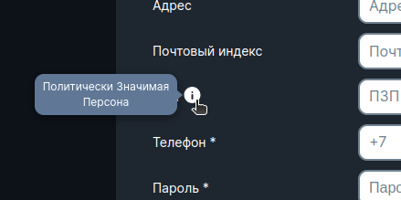
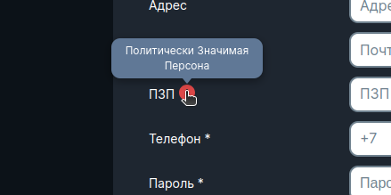
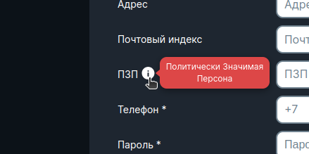
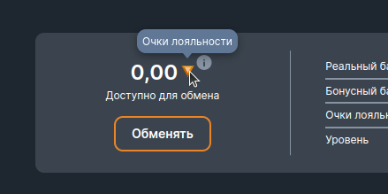

<ul class="nav nav-tabs" role="tablist">
    <li class="active">
        <a href="#english" role="tab" id="english-tab" data-toggle="tab" data-link="english">English</a>
    </li>
    <li>
        <a href="#russian" role="tab" id="russian-tab" data-toggle="tab" data-link="russian">Russian</a>
    </li>
</ul>
<div class="tab-content">
<div class="tab-pane fade active in" id="c-english">

# Tooltip Component
It displays a Modal or tooltip containing information about a particular instrument/indicator/value.

## Params
Interface [ITooltipCParams](/docs/compodoc/interfaces/ITooltipCParams.html#info)

```html
    <div wlc-icon
         class="{{$class}}__icon"
         containerClass="{{$class}}__bs-tooltip {{containerClassMod}}"
         placement="top"
         container="body"
         placement="left"
         [iconPath]="iconPath"
         [tooltip]="$params.inlineText | translate"
         boundariesElement="viewport">
    </div>
```
```typescript
export interface ITooltipCParams extends IComponentParams<unknown, unknown, ThemeMod> {
    inlineText?: string;
    iconName?: string;
    modal?: string;
    modalParams?: IIndexing<string>;
    placement?: 'top' | 'bottom' | 'left' | 'right' | 'auto';
    bsTooltipMod?: 'error' | string;
}

export const defaultParams: ITooltipCParams = {
    class: 'wlc-tooltip',
    inlineText: 'Info',
    iconName: 'info',
    placement: 'bottom',
};
```

- **inlineText** - displays text in tooltip
- **iconName** - an icon that, when hovered/clicked on, will open a tooltip/window
- **placement** - the location of the tooltip relative to the icon can take the following values:'top' | 'bottom' | 'left' | 'right' | 'auto'
- **themeMod** - assigns a style to the icon, default value is 'resolve', you can set 'error' or custom style via CustomType
- **bsTooltipMod** - assigns a style to the tooltip, default value is 'resolve', you can set 'error' or custom style
- **modal** -
using the key, assigns a specific Modal window that will pop up when you click on the specified icon (all existing Modal windows can be viewed in the file [modal.params.ts](/src/modules/core/components/modal/modal.params.ts) const MODALS_LIST)
- **modalParams** - allows you to create a custom Modal window

</div>
<div class="tab-pane fade" id="c-russian">

# Tooltip Component
Выводит Modal или всплывающую подсказку, содержащую информацию о том или ином инструменте/показателе/значении.

## Параметры
Интерфейс [ITooltipCParams](/docs/compodoc/interfaces/ITooltipCParams.html#info)

- **inlineText** - отражает текст во всплывающей подсказке
- **iconName** - иконка, при наведении/нажатии на которую будет открываться подсказка/окно
- **placement** - расположение подсказки относительно иконки, может принимать следующие значения: 'top' | 'bottom' | 'left' | 'right' | 'auto'
- **themeMod** - назначает стиль иконке, дефолтное значение 'resolve', можно поставить 'error' или кастомный стиль через CustomType
- **bsTooltipMod** - назначает стиль всплывающей подсказке, дефолтное значение 'resolve', можно поставить 'error' или кастомный стиль
- **modal** - с помощью ключа, назначает конкретное окно Modal, которое будет всплывать, при нажатии на указанную иконку (все существующие Modal окна, можно посмотреть в файле [modal.params.ts](/src/modules/core/components/modal/modal.params.ts) под константой MODALS_LIST)
- **modalParams** - даёт возможность создать кастомное окно Modal

```html
    <div wlc-icon
         class="{{$class}}__icon"
         containerClass="{{$class}}__bs-tooltip {{containerClassMod}}"
         placement="top"
         container="body"
         placement="left"
         [iconPath]="iconPath"
         [tooltip]="$params.inlineText | translate"
         boundariesElement="viewport">
    </div>
```
```typescript
export interface ITooltipCParams extends IComponentParams<unknown, unknown, ThemeMod> {
    inlineText?: string;
    iconName?: string;
    modal?: string;
    modalParams?: IIndexing<string>;
    placement?: 'top' | 'bottom' | 'left' | 'right' | 'auto';
    bsTooltipMod?: 'error' | string;
}

export const defaultParams: ITooltipCParams = {
    class: 'wlc-tooltip',
    inlineText: 'Info',
    iconName: 'info',
    placement: 'bottom',
};
```
##





</div>
</div>
