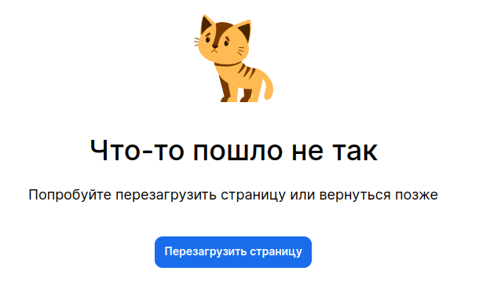

<ul class="nav nav-tabs" role="tablist">
    <li class="active">
        <a href="#english" role="tab" id="english-tab" data-toggle="tab" data-link="english">English</a>
    </li>
    <li>
        <a href="#russian" role="tab" id="russian-tab" data-toggle="tab" data-link="russian">Russian</a>
    </li>
</ul>
<div class="tab-content">
<div class="tab-pane fade active in" id="c-english">

## English

# Something-wrong-page Component
Error page.

 **Default look**


---

## Params

- **title**: `string` - title text for error
- **text**: `string` - text under title
- **buttonText**: `string` - text on the button
- **image**: `string` - pic above text

---
### Default params

```typescript
export const defaultParams: ISomethingWrongPageCParams = {
    moduleName: 'core',
    componentName: 'wlc-something-wrong-page',
    class: 'wlc-something-wrong-page',
    title: gettext('Something went wrong'),
    text: gettext('Try to reload the page or come back later'),
    buttonText: gettext('Reload the page'),
    image: 'wlc/decors/error-cat.svg',
};
```
### Using a component

```ts
'app.something-wrong': {
        sections: {
            content: {
                components: [
                    {
                        name: 'core.wlc-something-wrong-page',
                        params: {
                            title: gettext('Что-то не так'),
                            text: gettext('Попробуйте перезагрузить'),
                            buttonText: gettext('Перезагрузка'),
                            image: 'wlc/decors/custom-image.svg',
                        }
                    }
                ],
            },
        },
    },
```

</div>
<div class="tab-pane fade" id="c-russian">

---
## Russian
# Something-wrong-page Component
Страница, открывающаяся при ошибке.

## Параметры

- **title**: `string` - заголовок ошибки
- **text**: `string` - текст под заголовком
- **buttonText**: `string` - текст на кнопке
- **image**: `string` - картинка над текстом

---
### Дефолтные параметры
```typescript
export const defaultParams: ISomethingWrongPageCParams = {
    moduleName: 'core',
    componentName: 'wlc-something-wrong-page',
    class: 'wlc-something-wrong-page',
    title: gettext('Something went wrong'),
    text: gettext('Try to reload the page or come back later'),
    buttonText: gettext('Reload the page'),
    image: 'wlc/decors/error-cat.svg',
};
```
### Использование компонента

```ts
'app.something-wrong': {
        sections: {
            content: {
                components: [
                    {
                        name: 'core.wlc-something-wrong-page',
                        params: {
                            title: gettext('Что-то не так'),
                            text: gettext('Попробуйте перезагрузить'),
                            buttonText: gettext('Перезагрузка'),
                            image: 'wlc/decors/custom-image.svg',
                        }
                    }
                ],
            },
        },
    },
```
---

**Применённые стили/Custom styles**


</div>
</div>
